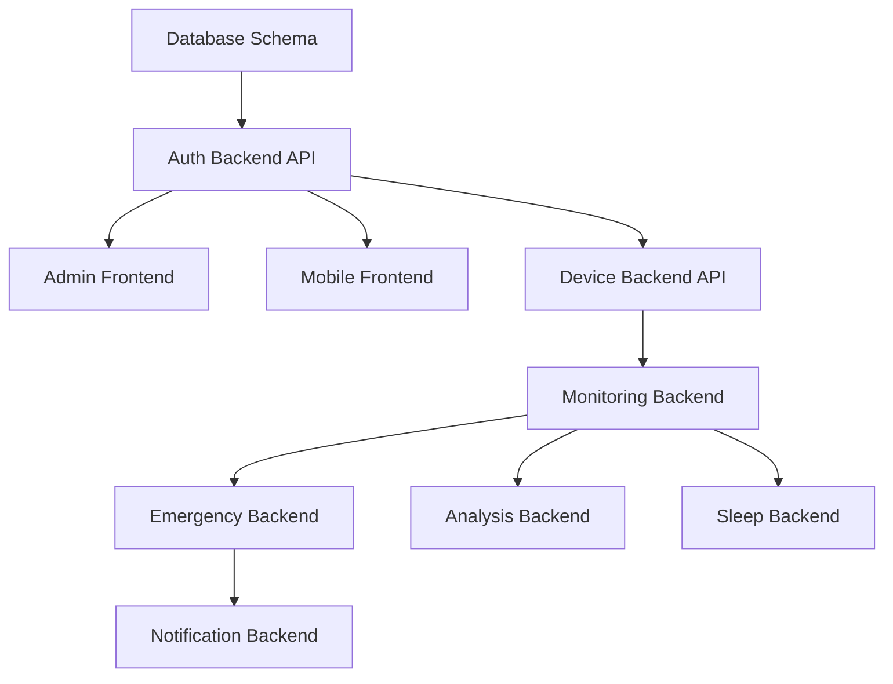

# Priority & Dependency Guide

## Priority Framework

### P0 — Highest (Critical Blockers)

**Criteria:** Without these, nothing else can function.

| Category       | Examples                                                  |
| -------------- | --------------------------------------------------------- |
| Infrastructure | Database schema, TimescaleDB setup, project scaffolding   |
| Security       | Authentication API, JWT implementation, role-based access |
| Core Framework | Express/FastAPI boilerplate, Prisma ORM setup             |

**Sprint placement:** Always Sprint 1 (or earliest available).

### P1 — High (Core MVP)

**Criteria:** Core business value that defines the product.

| Category          | Examples                                       |
| ----------------- | ---------------------------------------------- |
| Device Management | Pairing, configuration, data ingestion         |
| Health Monitoring | Real-time vitals, heart rate, SpO2             |
| Emergency         | Fall detection, SOS alerts, emergency contacts |

**Sprint placement:** Sprint 2-3, immediately after infrastructure.

### P2 — Medium (Important Supplementary)

**Criteria:** Enhances the product significantly but not launch-blocking.

| Category        | Examples                              |
| --------------- | ------------------------------------- |
| Notifications   | Push notifications, alert rules       |
| Sleep Analysis  | Sleep tracking, sleep quality scoring |
| Risk Analysis   | AI risk scoring, trend analysis       |
| Basic Reporting | Dashboard analytics, user statistics  |

**Sprint placement:** Sprint 3-4.

### P3 — Low (Nice-to-Have)

**Criteria:** Polish, advanced features, can be deferred post-MVP.

| Category        | Examples                                 |
| --------------- | ---------------------------------------- |
| Admin Config    | System settings, threshold configuration |
| Advanced Export | PDF/CSV report export, scheduled reports |
| UI Polish       | Animations, dark mode, onboarding flow   |

**Sprint placement:** Sprint 4+ or backlog.

---

## Dependency Chain Rules

### The Golden Rule
```
Database → Backend API → Frontend UI → QA Testing
```
Every feature follows this chain. NEVER reverse it.

### Cross-Module Dependencies



### Practical Rules

1. **Auth is always first** — Every API endpoint requires authentication
2. **Device before Monitoring** — Can't monitor without a paired device
3. **Monitoring before Emergency** — Fall detection needs sensor data
4. **Monitoring before Analysis** — Risk scoring needs health data history
5. **Backend before Frontend** — UI can't call APIs that don't exist
6. **Admin BE can parallel Mobile BE** — They share the same DB but are independent servers

---

## Story Point Calibration

Based on existing Sprint backlog patterns:

| SP  | Description                       | Time Estimate | Example from Project                 |
| --- | --------------------------------- | ------------- | ------------------------------------ |
| 1   | Config / minor change             | 0.5 day       | Logout endpoint (S07 in EP04)        |
| 2   | Single endpoint or UI page        | 1 day         | Admin Login API (S01 in EP04)        |
| 3   | Multiple endpoints or complex UI  | 1.5 days      | Mobile Login + Refresh (S02 in EP04) |
| 5   | Multi-feature with business logic | 2-3 days      | Password Reset flow                  |
| 8   | Complex cross-component feature   | 3-5 days      | Device pairing pipeline              |
| 13  | Full module implementation        | 1 week+       | Complete Sleep module                |

### Team Velocity Reference
- Sprint 1: ~42 SP (6 Epics, heavy infra)
- Sprint 2: ~26 SP (3 Epics, moderate)
- Sprint 3: ~23 SP (3 Epics, moderate)
- Sprint 4: ~36 SP (4 Epics, mixed)
- **Average: ~32 SP per Sprint**
