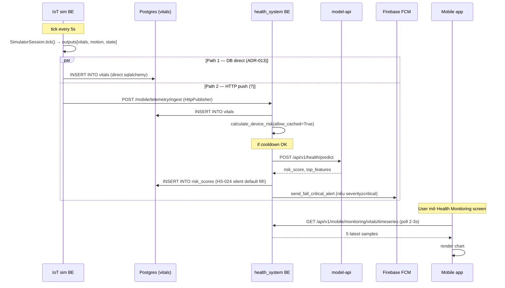
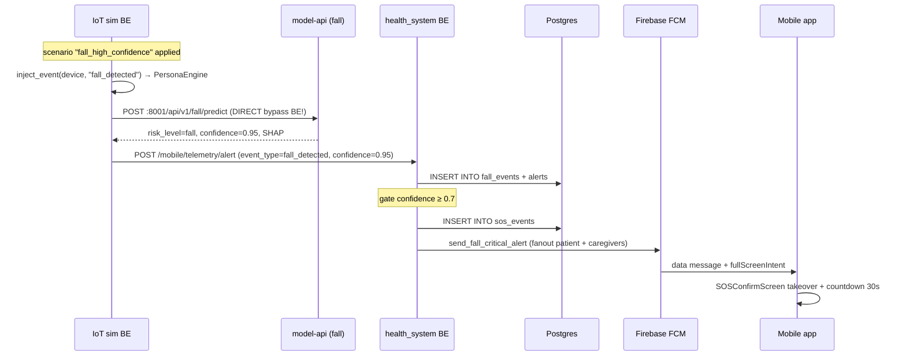
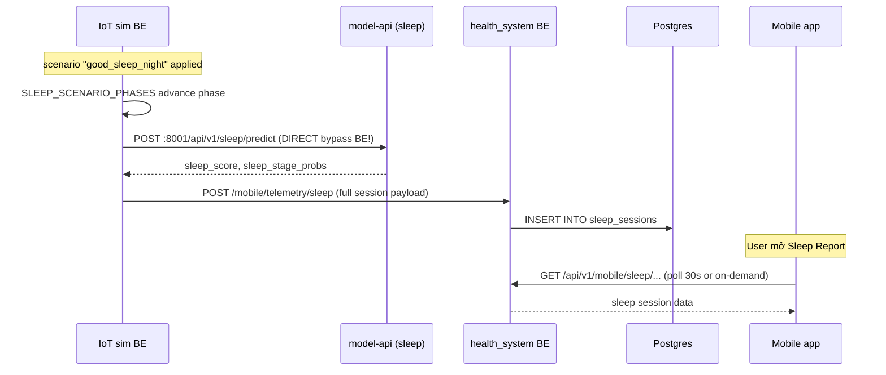
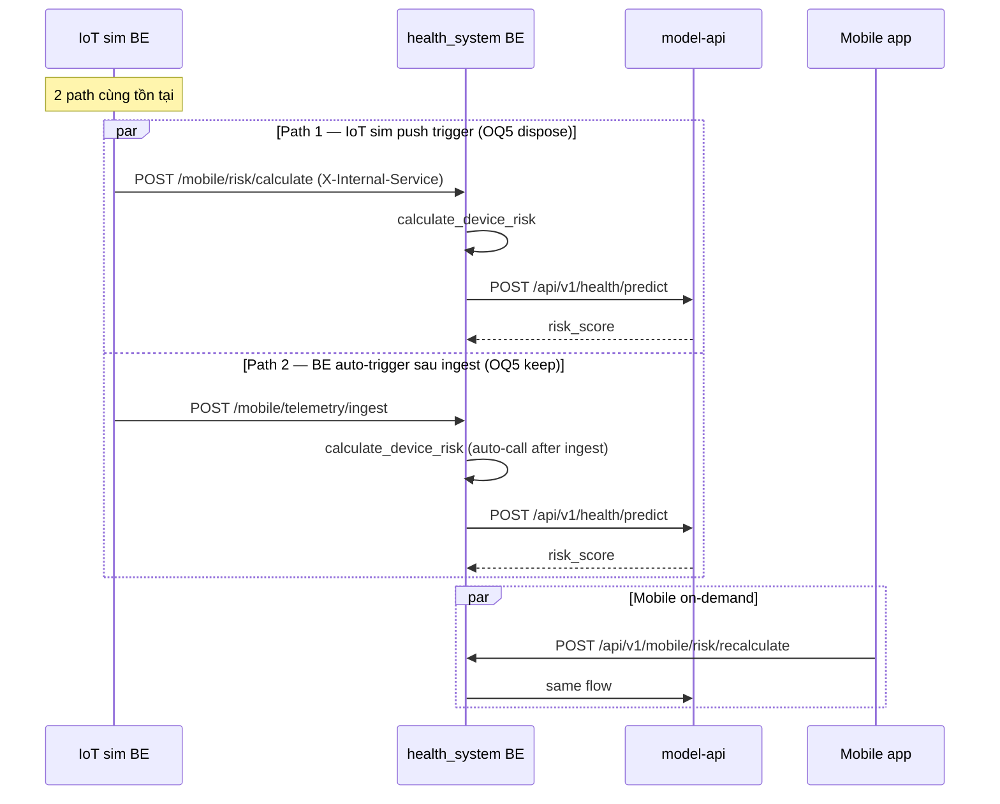

# Phase 1 — Current State Inventory

> **Goal:** Document chính xác state hiện tại của 5 repo trong scope redesign (Charter v1.0). Đây là baseline để Phase 2 (target topology) build gap analysis. Inventory này TIN ĐƯỢC — mọi mục đều có file:line citation.

**Phase:** P1 — Current State Inventory
**Date:** 2026-05-15
**Author:** Cascade
**Reviewer:** ThienPDM (pending)
**Status:** 🟡 In Progress
**Charter:** `00_charter.md` v1.0

---

## 1. Repo state — 5 workspace

| Repo | Path | Trunk | Branch hiện tại | Dirty? | Note |
|---|---|---|---|---|---|
| `Iot_Simulator_clean` | `d:\DoAn2\VSmartwatch\Iot_Simulator_clean` | `develop` | `develop` | Clean | Owner: manhthien2005 |
| `health_system` | `d:\DoAn2\VSmartwatch\health_system` | `develop` | `develop` | Clean | Owner: Minh6625 |
| `healthguard-model-api` | `d:\DoAn2\VSmartwatch\healthguard-model-api` | `master` | `master` | Clean | Owner: lat08 |
| `HealthGuard` (admin web) | `d:\DoAn2\VSmartwatch\HealthGuard` | `develop` | `develop` | Clean | Owner: lat08 |
| `PM_REVIEW` | `d:\DoAn2\VSmartwatch\PM_REVIEW` | `main` | `chore/redesign-iot-sim-2026` | Clean (commits: `4039cea` Charter v0.1, `28730e2` Charter v1.0) | Owner: manhthien2005 |

**Verification commands:**
```pwsh
git rev-parse --abbrev-ref HEAD  # mỗi repo
git status --short
```

**Implication redesign:** Mọi repo trunk clean → không có pending PR khác blocking. Em có thể design + plan mà không worry về merge conflict ngắn hạn.

---

## 2. IoT Simulator BE inventory (`Iot_Simulator_clean/`)

### 2.1 Tech stack
- **Framework:** FastAPI + uvicorn (port 8002)
- **Entry:** `@d:\DoAn2\VSmartwatch\Iot_Simulator_clean\api_server\main.py:74`
- **Lifecycle:** `lifespan` context → `SimulatorRuntime()` singleton + `start_background_tick()` + `recover_active_sessions()`
- **CORS:** allowlist `http://localhost:5173,5174` (simulator-web FE)
- **Middleware:** `RateLimitMiddleware` (added before CORS, LIFO so CORS outermost)

### 2.2 Router prefix (CRITICAL drift với ADR-004)

**Current:** 10 router mount với prefix `/api/sim` (THIẾU `v1`)

```python
# @d:\DoAn2\VSmartwatch\Iot_Simulator_clean\api_server\main.py:92-101
app.include_router(devices_router, prefix="/api/sim")
app.include_router(dashboard_router, prefix="/api/sim")
app.include_router(registry_router, prefix="/api/sim")
app.include_router(scenarios_router, prefix="/api/sim")
app.include_router(sessions_router, prefix="/api/sim")
app.include_router(vitals_router, prefix="/api/sim")
app.include_router(events_router, prefix="/api/sim")
app.include_router(verification_router, prefix="/api/sim")
app.include_router(analytics_router, prefix="/api/sim")
app.include_router(settings_router, prefix="/api/sim")
```

**Target ADR-004:** `/api/v1/sim/*`

**Drift severity:** Medium (chỉ ảnh hưởng simulator-web FE consumer, không ảnh hưởng cross-repo)

### 2.3 IoT sim outbound clients (CRITICAL cho redesign)

| Client | File | Endpoint hit | Vai trò trong redesign |
|---|---|---|---|
| **Direct DB writer** | `dependencies.py:1011-1056` (`_execute_pending_tick_publish`) | `INSERT INTO vitals` (sqlalchemy direct) | KEEP hay DISPOSE — Phase 4 ADR-020 |
| **HttpPublisher (vitals)** | `dependencies.py:670-674` + transport_router | `POST /mobile/telemetry/ingest` | UNCERTAIN — em flag em chưa verify path này có active không |
| **AlertService** | `services/alert_service.py:_push_alert_to_backend` | `POST /mobile/telemetry/alert` | KEEP — cần migrate `/api/v1/mobile/telemetry/alert` |
| **SleepService** | `services/sleep_service.py:587` + `:645` | `POST /mobile/telemetry/sleep` | KEEP — cần migrate `/api/v1/mobile/telemetry/sleep` |
| **`_trigger_risk_inference`** | `dependencies.py:1206-1237` | `POST /mobile/risk/calculate` | **DISPOSE** (OQ5 chốt — BE auto-trigger) |
| **`FallAIClient`** | `simulator_core/fall_ai_client.py:391` | `POST :8001/api/v1/fall/predict` **DIRECT** | **DISPOSE** (OQ2 + ADR-019 — qua BE) |
| **`SleepAIClient`** | `simulator_core/sleep_ai_client.py:69` | `POST :8001/api/v1/sleep/predict` **DIRECT** | **DISPOSE** (qua BE thông qua `/telemetry/sleep`) |
| **`BackendAdminClient`** | `backend_admin_client.py:45` | `POST /mobile/admin/*` | KEEP — migrate `/api/v1/mobile/admin/*` |
| **`MobileTelemetryClient`** (slice 2b) | `?` (em chưa locate) | `/api/v1/mobile/telemetry/imu-window`, `/sleep-risk` | **ORPHAN — WIRE vào** (resolve dead code, dùng cho fall flow target) |

**Issue inventory:**
- Vitals dual-path: Direct DB write + HttpPublisher cùng tồn tại → em verify Phase 1.x
- Direct AI client bypass production flow (OQ5 đã chốt fix)
- Endpoint prefix drift (OQ1 đã chốt fix)
- MobileTelemetryClient orphan (cần wire khi build slice 2b)

### 2.4 Routers IoT sim BE — purpose mỗi router

| Router | File | Endpoint pattern | Consumer | Trong scope? |
|---|---|---|---|---|
| `devices` | `routers/devices.py` (11KB) | `/api/sim/devices/*` | simulator-web FE | ✅ Yes (CRUD device + bind admin) |
| `dashboard` | `routers/dashboard.py` (0.5KB) | `/api/sim/dashboard` | simulator-web FE | ⚠️ Limited (chỉ aggregate stats) |
| `registry` | `routers/registry.py` (0.4KB) | `/api/sim/registry` | simulator-web FE | ⚠️ Limited (list known scenarios) |
| `scenarios` | `routers/scenarios.py` (19KB) | `/api/sim/scenarios/apply` | simulator-web FE | ✅ Yes (CORE trigger mọi flow demo) |
| `sessions` | `routers/sessions.py` (3KB) | `/api/sim/sessions/*` | simulator-web FE | ✅ Yes (create/start/stop session, fall-state) |
| `vitals` | `routers/vitals.py` (0.7KB) | `/api/sim/vitals/last` | simulator-web FE | ⚠️ Limited (chỉ peek latest sample) |
| `events` | `routers/events.py` (2KB) | `/api/sim/events/*` | simulator-web FE | ✅ Yes (event recording for replay) |
| `analytics` | `routers/analytics.py` (3KB) | `/api/sim/analytics/*` | simulator-web FE | ⚠️ Limited |
| `verification` | `routers/verification.py` (0.7KB) | `/api/sim/verification` | simulator-web FE | ⚠️ Limited (smoke test endpoint) |
| `settings` | `routers/settings.py` (7KB) | `/api/sim/settings/*` | simulator-web FE | ✅ Yes (tick_interval, push_interval, AI config) |

### 2.5 Scenarios — 13 built-in

`@d:\DoAn2\VSmartwatch\Iot_Simulator_clean\api_server\routers\scenarios.py:67-309`

| Nhóm | Scenarios | Số lượng |
|---|---|---|
| **Vitals** | `normal_rest`, `tachycardia_warning`, `hypoxia_critical`, `hypertension_moderate`, `normal_walking` | 5 |
| **Fall** | `fall_high_confidence`, `fall_false_alarm`, `fall_no_response` | 3 |
| **Sleep** | `good_sleep_night`, `fragmented_sleep`, `elderly_normal` | 3 |
| **Risk inject** | `high_risk_cardiac`, `medium_risk_general` | 2 |

**Drive method:**
- Vitals → thay đổi baseline trong `VitalsGenerator` (load từ datasets BIDMC/VitalDB/WESAD/PAMAP2)
- Fall → `inject_event(device, "fall_detected", variant)` → PersonaEngine transit → MotionGenerator chọn fall window
- Sleep → `inject_event(device, "sleep_start", phase)` → SLEEP_SCENARIO_PHASES driven (YAML)
- Risk inject → bypass pipeline, chèn thẳng `risk_score` row

### 2.6 WebSocket channels

| Endpoint | File | Purpose |
|---|---|---|
| `/ws/logs/{session_id}` | `main.py:113-115` + `ws/log_stream.py` | Stream device log realtime cho simulator-web Diagnostics page |

**Note:** Chỉ 1 WebSocket channel hiện tại. Phase 2 cân nhắc thêm `/ws/tick/{session_id}` để stream vitals realtime cho simulator-web SessionRunner page.

---

## 3. IoT Simulator FE inventory (`Iot_Simulator_clean/simulator-web/`)

### 3.1 Tech stack
- **Framework:** React 18 + Vite + TypeScript
- **Routing:** `react-router-dom` (lazy load)
- **Entry:** `@d:\DoAn2\VSmartwatch\Iot_Simulator_clean\simulator-web\src\App.tsx:28`

### 3.2 Routes & pages (8 pages)

| Path | Component | Purpose | Trong scope redesign? |
|---|---|---|---|
| `/dashboard` | `DashboardPage` (6KB) | Overview stats | ⚠️ Limited (overview only) |
| `/devices` | `DevicesPage` (16KB) | Device CRUD + bind admin user | ✅ Yes (cần demo bind elderly + family) |
| `/session` | `SessionRunnerPage` (12KB) | **CORE demo page** — apply scenario, view tick, control session | ✅ **CRITICAL** — focus redesign UX narrative |
| `/fall-lab` | `FallLabPage` (10KB) | Standalone fall scenario lab | ⚠️ Optional (có thể merge vào SessionRunner) |
| `/analytics` | `AnalyticsPage` (6KB) | Analytics dashboard | ⚠️ Limited |
| `/diagnostics` | `DiagnosticsPage` (7KB) | WebSocket log viewer | ✅ Yes (giữ cho debug) |
| `/verification` | `VerificationPage` (4KB) | Smoke test E2E | ⚠️ Limited |
| `/settings` | `SettingsPage` (16KB) | Tick config, AI config, persistence | ✅ Yes (cần expose pattern setting demo) |

### 3.3 Session Runner page — current UX

`@d:\DoAn2\VSmartwatch\Iot_Simulator_clean\simulator-web\src\pages\SessionRunnerPage.tsx`

**Hiện có:**
- Device card list (left)
- Scenario picker dropdown
- "Apply scenario" button
- Speed slider (1x, 5x, 10x)
- Tick interval display
- Last tick output panel (right)
- Fall countdown overlay (khi scenario `fall_no_response`)
- Push status chip (mỗi tick có push thành công không)

**Thiếu cho redesign target:**
- ❌ Sequence diagram live (panel chấm xem flow)
- ❌ Status chips từng bước (vitals row inserted → BE auto-risk → FCM sent)
- ❌ Multi-device coordinator view (cho linked profile demo OQ4)
- ❌ "Demo mode" toggle (polling 1Hz vs 3s)
- ❌ Mobile receiver mirror preview (panel chấm thấy điện thoại nhận gì)

---

## 4. health_system Backend inventory (`health_system/backend/`)

### 4.1 Tech stack
- **Framework:** FastAPI + uvicorn (port 8000)
- **Entry:** `@d:\DoAn2\VSmartwatch\health_system\backend\app\main.py`
- **DB:** PostgreSQL + TimescaleDB (vitals table = hypertable)
- **ORM:** SQLAlchemy
- **Mount:** `root_path="/api/v1"` (metadata) + `api_router` prefix=`/mobile` → effective `/api/v1/mobile/*`

### 4.2 Routers chính (14 routers)

`@d:\DoAn2\VSmartwatch\health_system\backend\app\api\router.py`

| Router | File | Endpoints scope redesign | Note |
|---|---|---|---|
| **`telemetry`** | `routes/telemetry.py` (29KB) | `/ingest`, `/alert`, `/sleep`, `/imu-window`, `/sleep-risk` (all `require_internal_service`) | ✅ **CORE inbound từ IoT sim** |
| **`risk`** | `routes/risk.py` (22KB) | `/risk/recalculate` (user), `/risk/calculate` (internal), `/risk/latest`, `/risk/{id}/detail`, `/risk/history`, `/risk/alerts/{notif_id}/respond` | ✅ Risk path |
| `relationships` | `routes/relationships.py` (6KB) | `/relationships/dashboard`, `/relationships/{id}/detail`, `/relationships/{id}/medical-info`, etc | ✅ Family linked profile (OQ4) |
| `notifications` | `routes/notifications.py` (6KB) | `/notifications`, `/notifications/{id}/read`, `/notifications/push-token`, `/notifications/push-token/unregister` | ✅ FCM token register |
| `emergency` | `routes/emergency.py` (6KB) | SOS endpoints | ✅ Fall flow consumer |
| `fall_events` | `routes/fall_events.py` (7KB) | Fall event CRUD | ✅ Phase 3 contract |
| `monitoring` | `routes/monitoring.py` (7KB) | `/monitoring/vitals/timeseries` etc | ✅ **CORE mobile consumer** — vitals chart polling |
| `device` | `routes/device.py` (7KB) | Device CRUD mobile | ⚠️ Limited |
| `admin` | `routes/admin.py` (8KB) | Admin endpoint mobile | ⚠️ Limited |
| `auth` | `routes/auth.py` (14KB) | Login/register/refresh JWT | ⚠️ Limited (đã ổn) |
| `health` | `routes/health.py` (0.2KB) | Health check | ⚠️ Limited |
| `profile` | `routes/profile.py` (1.5KB) | User profile | ⚠️ Limited |
| `settings` | `routes/settings.py` (1.8KB) | User settings | ⚠️ Limited |
| `analysis` | `?` (em chưa locate) | `/analysis/risk-reports`, `/analysis/risk-history` (gọi từ mobile) | ⚠️ Locate Phase 1.x |

**Drift:** Mobile gọi `/analysis/*` nhưng em chưa tìm thấy router file `analysis.py` — em verify Phase 1.x

### 4.3 Telemetry endpoints chi tiết (CORE redesign)

`@d:\DoAn2\VSmartwatch\health_system\backend\app\api\routes\telemetry.py`

| Method | Path | Auth | Schema | Persist | Trigger downstream |
|---|---|---|---|---|---|
| POST | `/telemetry/ingest` | `require_internal_service` | `VitalIngestRequest` | INSERT INTO vitals | Auto `calculate_device_risk(dispatch_alerts=True)` |
| POST | `/telemetry/alert` | `require_internal_service` | `AlertIngestRequest` | INSERT INTO alerts + fall_events + sos_events | FCM push qua `PushNotificationService.send_fall_critical_alert` |
| POST | `/telemetry/sleep` | `require_internal_service` | `SleepIngestRequest` | INSERT INTO sleep_sessions | Optional risk evaluation |
| POST | `/telemetry/imu-window` | `require_internal_service` | `ImuWindowRequest` | INSERT INTO fall_events + (target) imu_windows | Auto fall predict qua model-api |
| POST | `/telemetry/sleep-risk` | `require_internal_service` | `SleepRiskRequest` | UPDATE sleep_sessions risk score | Optional alert |

### 4.4 Push Notification Service (CORE FCM)

`@d:\DoAn2\VSmartwatch\health_system\backend\app\services\push_notification_service.py`

**Methods quan trọng (em đã verify):**
- `send_fall_critical_alert(patient_user_id, fall_event_id, confidence)` — fanout FCM tới user + caregivers, full-screen takeover payload
- `send_fall_followup_concern(patient_user_id, fall_event_id, ...)` — caregiver-only soft push, regular notification
- `EmergencyRepository.get_alert_recipient_user_ids(db, patient_user_id)` — fetch linked caregivers từ `UserRelationship`

**FCM payload structure (need verify Phase 3):**
- Data-only message (background-safe) vs notification message (foreground-rendered)
- `fullScreenIntent` flag cho critical
- Severity discrimination

**Test infra:** `E2E_DISABLE_PUSH=1` env flag để skip FCM khi e2e test

### 4.5 Risk service (CORE)

`@d:\DoAn2\VSmartwatch\health_system\backend\app\services\risk_alert_service.py`

**Methods chính:**
- `calculate_device_risk(db, device_id, user_id, allow_cached=True, dispatch_alerts=True)` — gọi từ `/telemetry/ingest` và `/risk/recalculate`
- `_fetch_latest_vitals` — lines 89-153 — **HS-024 bug location** (chỉ reject khi cả HR + SpO2 NULL, không reject per-field)
- `_build_inference_payload` — lines 155-201 — **HS-024 bug location** (fill default silently cho HR/RR/temp/SpO2, chỉ track defaults_applied cho 5 field còn lại)
- `dispatch_risk_alerts` — push alert qua `PushNotificationService` nếu severity ≥ medium

**Cooldown:** `RISK_COOLDOWN_SECONDS = 60` (default, configurable)
**Cache:** `allow_cached=True` reuse last result trong cooldown window

### 4.6 Model API Adapter

`@d:\DoAn2\VSmartwatch\health_system\backend\app\adapters\model_api_health_adapter.py`

**Method `to_record`:** convert inference_payload → VitalsRecord cho model-api `/predict`. **Bug HS-024 layer 2** — fill default lần 2, drift với layer 1 (HRV: layer 1 = 40, layer 2 = 50).

---

## 5. health_system Mobile inventory (`health_system/lib/`)

### 5.1 Tech stack
- **Framework:** Flutter + Riverpod state mgmt
- **HTTP:** `http.Client` (NOT dio — different from Express+Prisma admin)
- **Push:** `firebase_messaging` + `flutter_local_notifications`
- **Entry baseUrl:** `http://10.0.2.2:8000/api/v1/mobile` (env `API_URL` override)

### 5.2 Feature modules (12 features)

`@d:\DoAn2\VSmartwatch\health_system\lib\features\`

| Feature | Folders | Trong scope redesign? | Note |
|---|---|---|---|
| **`analysis`** | domain, presentation, providers, repositories, utils (5) | ✅ Yes | Risk Report + Detail + History (mobile consume `/analysis/*`) |
| **`auth`** | 22 items | ⚠️ Limited | JWT login, đã ổn |
| **`device`** | 35 items | ⚠️ Limited | Device pairing (mobile user) |
| **`emergency`** | 17 items (4 screens) | ✅ Yes | **SOSConfirmScreen, EmergencySOSDetailScreen, ManualSOSScreen** — Critical fall takeover |
| **`fall`** | 8 items | ✅ Yes | Fall events list |
| **`family`** | 45 items | ✅ Yes | Linked profile dashboard (OQ4) |
| **`health_monitoring`** | 23 items (2 screens) | ✅ Yes | **VitalsScreen, VitalDetailScreen** — vitals chart polling |
| **`home`** | 14 items | ✅ Yes | **HomeDashboardScreen** — hero vitals + risk insight + sleep insight |
| **`notifications`** | 18 items (2 screens) | ✅ Yes | Notification list + FCM handler |
| **`onboarding`** | 1 item | ⚠️ Limited | |
| **`profile`** | 11 items | ⚠️ Limited | |
| **`sleep_analysis`** | 18 items (4 screens) | ✅ Yes | **SleepReportScreen, SleepDetailScreen, SleepHistoryScreen** |

### 5.3 API consumer paths (mobile → BE)

Em đã verify qua grep:

| Mobile path | BE route | Feature consumer |
|---|---|---|
| `GET /analysis/risk-reports?limit=N` | ⚠️ Chưa locate router | `home/repositories/home_dashboard_repository.dart:152`, `analysis/repositories/risk_analysis_repository.dart:124` |
| `GET /analysis/risk-reports/{id}` | ⚠️ Chưa locate router | `risk_analysis_repository.dart:185` |
| `GET /analysis/risk-history` | ⚠️ Chưa locate router | `risk_analysis_repository.dart:320` |
| `POST /risk/recalculate` | `routes/risk.py:341` | `risk_analysis_repository.dart:292` |
| `POST /risk/alerts/{notif_id}/respond` | `routes/risk.py:313` | `emergency/repositories/emergency_caregiver_repository.dart:132` |
| `GET /relationships/dashboard` | `routes/relationships.py:23` | `family/repositories/family_repository.dart:42` |
| `GET /relationships/{id}/detail` | `routes/relationships.py:35` | `family_repository.dart:61` |
| `GET /relationships/{id}/medical-info` | `routes/relationships.py:48` | `family_repository.dart:85` |
| `GET/POST/PUT/DELETE /relationships/...` | `routes/relationships.py:78-161` | `family_repository.dart:108-262` |
| `POST /notifications/push-token` | `routes/notifications.py:86` | `notifications/services/notification_runtime_service.dart:891` |
| `POST /notifications/push-token/unregister` | `routes/notifications.py:105` | `notification_runtime_service.dart:919` |

**Drift cần verify:** mobile gọi `/analysis/*` nhưng `app/api/router.py` không list analysis router. → Em check Phase 1.x

### 5.4 Mobile screens map theo simulation trigger

| Scenario IoT sim | Mobile screen trigger | Widget update |
|---|---|---|
| `normal_rest`, `normal_walking` | `HomeDashboardScreen` hero, `VitalsScreen` | `health_status_hero_card.dart`, `vital_metric_card.dart`, `live_vitals_section.dart` |
| `tachycardia_warning` | + `RiskInsightCard` đỏ | `risk_insight_card.dart`, `notifications_screen.dart` |
| `hypoxia_critical` | + `RiskReportDetailScreen` critical | `risk_report_detail_screen.dart`, full FCM banner |
| `hypertension_moderate` | `VitalsScreen` BP card đỏ | `blood_pressure_card.dart` |
| `fall_high_confidence` | **`SOSConfirmScreen` takeover** | `sos_confirm_screen.dart` (15KB), countdown widget |
| `fall_false_alarm` | `NotificationsScreen` chỉ | No takeover |
| `fall_no_response` | **`SOSConfirmScreen` force takeover** | Cannot dismiss |
| `good_sleep_night` | `SleepReportScreen` | `sleep_insight_card.dart`, sleep stage chart |
| `fragmented_sleep` | `SleepDetailScreen` | + risk banner |
| `high_risk_cardiac` | `RiskReportDetailScreen` critical | + FCM banner |
| `medium_risk_general` | `RiskInsightCard` warning | |

---

## 6. healthguard-model-api inventory (`healthguard-model-api/`)

### 6.1 Tech stack
- **Framework:** FastAPI (port 8001)
- **ML:** ONNX + scikit-learn + SHAP
- **Auth:** `verify_internal_secret` middleware (post D-013 fix)

### 6.2 Endpoints catalog

`@d:\DoAn2\VSmartwatch\healthguard-model-api\app\routers\`

| Path | Method | Schema | Auth | Output |
|---|---|---|---|---|
| **System** | | | | |
| `GET /healthz` | GET | - | None | Overall health status |
| `GET /api/v1/models` | GET | - | None | List all models |
| **Fall** | | | | |
| `POST /api/v1/fall/predict` | POST | `FallPredictionRequest` (motion window 9-axis) | `verify_internal_secret` | `FallPredictionResponse` (risk_level, confidence, top_features, SHAP) |
| `GET /api/v1/fall/model-info` | GET | - | None | Model metadata |
| `GET /api/v1/fall/sample-cases` | GET | - | None | Sample evaluate-fall vs not_fall cases |
| `GET /api/v1/fall/sample-input` | GET | `?case=` | None | Sample input cho debug |
| **Health (risk)** | | | | |
| `POST /api/v1/health/predict` | POST | `HealthPredictionRequest` (`VitalsRecord` array) | `verify_internal_secret` | `HealthPredictionResponse` (risk_level, top_features, SHAP) |
| `POST /api/v1/health/predict/batch` | POST | Same | `verify_internal_secret` | Same |
| `GET /api/v1/health/model-info` | GET | - | None | Model metadata |
| `GET /api/v1/health/sample-cases` | GET | - | None | Sample low-risk vs high-risk cases |
| `GET /api/v1/health/sample-input` | GET | `?case=` | None | Sample input |
| **Sleep** | | | | |
| `POST /api/v1/sleep/predict` | POST | `SleepPredictionRequest` (41-field record) | `verify_internal_secret` | `SleepPredictionResponse` (sleep_score, sleep_stage_probs) |
| `POST /api/v1/sleep/predict/batch` | POST | Same | `verify_internal_secret` | Same |
| `GET /api/v1/sleep/model-info` | GET | - | None | Model metadata |
| `GET /api/v1/sleep/sample-cases` | GET | - | None | Good vs poor sleep cases |
| `GET /api/v1/sleep/sample-input` | GET | `?case=` | None | Sample input |

### 6.3 Schema gaps (XR-003)

`@d:\DoAn2\VSmartwatch\healthguard-model-api\app\schemas\health.py` (em flag — chưa deep-read):
- `VitalsRecord` thiếu `Field(ge=..., le=...)` cho `heart_rate`, `spo2`, `temperature`, BP
- Không có field `is_synthetic_default: bool`
- Không có structured error code khi reject

**Resolution:** Phase 4 ADR-018 sẽ chốt validation contract.

---

## 7. HealthGuard Admin Web inventory (`HealthGuard/`) — limited scope

### 7.1 Tech stack (em đã biết từ context)
- **Backend:** Express + Prisma (port 5000)
- **Frontend:** Vite + React
- **DB:** Postgres (shared với health_system) — Prisma là source of truth schema
- **WebSocket:** Có infra (em đã thấy reference `expose_headers` CORS)

### 7.2 Trong scope redesign chỉ:
- Verify WebSocket consumer cho realtime ops dashboard (em chưa scan detail trong session này)
- KHÔNG redesign admin UX

### 7.3 Action ownership
- Phase 2: scan limited WebSocket integration paths
- Phase 7: nếu cần add WebSocket consumer cho live demo (admin xem multiple device cùng panel)

---

## 8. Database schema inventory (relevant tables)

### 8.1 Canonical source
- **Source of truth:** `@d:\DoAn2\VSmartwatch\health_system\SQL SCRIPTS\` (10 files numbered 01-10)
- **Combined:** `@d:\DoAn2\VSmartwatch\PM_REVIEW\SQL SCRIPTS\init_full_setup.sql`

### 8.2 Tables relevant cho redesign

| Table | SQL file | Hypertable? | Phase 1 status | Gap target |
|---|---|---|---|---|
| `vitals` | `04_create_tables_timeseries.sql` | ✅ TimescaleDB | Em đã verify schema | Cần verify columns match HS-024 fix |
| `fall_events` | `05_create_tables_events_alerts.sql` | ❌ Regular | Em đã verify exists | Cần FK `imu_window_id` reference (target) |
| `sos_events` | `05_create_tables_events_alerts.sql` | ❌ Regular | Em đã verify exists | OK |
| `alerts` | `05_create_tables_events_alerts.sql` | ❌ Regular | OK | OK |
| `risk_scores` | `06_create_tables_ai_analytics.sql` | ❌ Regular | OK | Cần add `is_synthetic_default`, `defaults_applied` JSON columns (target) |
| **`imu_windows`** | ❌ **CHƯA TỒN TẠI** | Target: TimescaleDB hypertable + retention 7d + compress | **MISSING** (OQ2) | Phase 3 contract + Phase 4 migration SQL |
| `push_tokens` | `02_create_tables_user_management.sql` | ❌ Regular | OK | OK |
| `user_relationships` | `02_create_tables_user_management.sql` | ❌ Regular | OK | Verify default permission per HS-012 fix |
| `sleep_sessions` | `04_create_tables_timeseries.sql` | ⚠️ ? | Em verify Phase 1.x | OK probably |

### 8.3 Migrations đã apply (recent)
`@d:\DoAn2\VSmartwatch\health_system\backend\migrations\`

- `20260416_alert_type_alignment.sql`
- `20260416_risk_alert_escalation.sql`
- `20260424_shap_explanation_columns.sql`
- `20260427_audience_payload_json.sql`
- `20260427_model_request_id.sql`
- `20260427_sleep_risk_type.sql`
- `20260430_relationship_view_medical_info.sql`
- `20260501_fall_event_survey_answers.sql`
- `add_sleep_unique_constraint.sql`

**Phase 4 migration cần thêm:**
- `imu_windows` hypertable + retention + compression policy (OQ2)
- `risk_scores.is_synthetic_default` + `defaults_applied` JSON (HS-024 fix)
- Optional: `fall_events.imu_window_id` FK to `imu_windows`

---

## 9. Dead code / orphan candidates

### 9.1 Confirmed orphan (em đã verify hoặc strongly suspected)

| Code | Location | Reason orphan | Action redesign |
|---|---|---|---|
| `MobileTelemetryClient` (slice 2b) | Em chưa locate file | Em grep `MobileTelemetryClient` trong `api_server/` không match → có thể trong `pre_model_trigger/` hoặc test fixtures | **WIRE** thay vì delete — đây là path chuẩn `/api/v1/mobile/telemetry/imu-window` |
| `SleepRiskDispatcher` | `pre_model_trigger/sleep_dispatch.py:133-159` | Không có caller wire vào runtime | Verify Phase 2 — wire vào hoặc dispose |
| `_trigger_risk_inference` | `dependencies.py:1206-1237` | OQ5 chốt dispose | **DISPOSE** Phase 7 |
| `_risk_calculate_endpoint` | `dependencies.py:921-923` | OQ5 chốt dispose | **DISPOSE** Phase 7 |
| Direct `FallAIClient` call | `dependencies.py:1570` | OQ2 chốt dispose | **DISPOSE** Phase 7, thay bằng `/telemetry/imu-window` |
| Direct `SleepAIClient` call | `sleep_service.py` | Sleep flow chuyển qua BE | **DISPOSE** Phase 7 |
| FastAPI `root_path="/api/v1"` | `health_system/backend/app/main.py:28` | OQ1 chốt drop hack | **DROP** Phase 7 |

### 9.2 Vitals dual-path uncertainty (cần verify Phase 1.x)

- `_execute_pending_tick_publish` DB direct write (ADR-013) — line 1011-1056
- `HttpPublisher` wired trong `transport_router` — line 670-674

Cả 2 path đều có endpoint setup. Em chưa clear path nào active. → Phase 1.x verify, Phase 4 ADR-020 chốt.

---

## 10. Cross-repo data flow current state — sequence diagram

### 10.1 Vitals flow (current — dual path uncertain)



### 10.2 Fall flow (current — bypass BE for AI)



### 10.3 Sleep flow (current — bypass BE for AI)



### 10.4 Risk flow (current — dual trigger)



### 10.5 Endpoint prefix mismatch matrix (drift visualized)

| Caller | Hits path | Target ADR-004 |
|---|---|---|
| Mobile app | `/api/v1/mobile/*` | ✅ Match (đã đúng) |
| IoT sim telemetry | `/mobile/telemetry/*` | ❌ Cần đổi `/api/v1/mobile/telemetry/*` |
| IoT sim risk | `/mobile/risk/calculate` | ❌ DISPOSE (OQ5) |
| IoT sim admin | `/mobile/admin/*` | ❌ Cần đổi `/api/v1/mobile/admin/*` |
| IoT sim sleep | `/mobile/telemetry/sleep` | ❌ Cần đổi `/api/v1/mobile/telemetry/sleep` |
| simulator-web FE | `/api/sim/*` | ❌ Cần đổi `/api/v1/sim/*` |
| HealthGuard admin web | `/api/v1/admin/*` | ✅ Match |
| HealthGuard BE → mobile BE (internal) | `/api/v1/internal/*` | ✅ Match |
| Steering doc claim | `/api/internal/*` | ❌ Sai cả 2 phía (XR-001) |

---

## 11. Verification checklist trước khi sang Phase 2

| Item | Status | Verify command |
|---|---|---|
| Repo trunk clean | ✅ All 5 repos clean | `git status --short` cho 5 path |
| 13 scenarios listed | ✅ Verified `scenarios.py:67-309` | Em đã đọc |
| 10 IoT sim BE routers listed | ✅ Verified `routers/__init__.py` + dir listing | Em đã đọc |
| 14 health_system BE routers listed | ✅ Verified `app/api/router.py` | Em đã đọc |
| Model-api 4 routers listed | ✅ Verified | Em đã đọc |
| Mobile features listed | ✅ 12 features verified | Em đã đọc |
| Push fanout caregivers verified | ✅ `push_notification_service.py:417-666` | Em đã đọc |
| `/analysis/*` mobile path → BE router | ⏳ **Pending Phase 1.x** | Em chưa locate analysis router |
| `imu_windows` table không tồn tại | ✅ Confirmed | grep CREATE TABLE imu_windows = 0 hit |
| `MobileTelemetryClient` orphan location | ⏳ **Pending Phase 1.x** | Em chưa locate file |
| `SleepRiskDispatcher` wire status | ⏳ **Pending Phase 1.x** | Em đã thấy file, chưa verify caller |
| Vitals dual-path active status | ⏳ **Pending Phase 1.x** | Direct DB vs HttpPublisher — verify path nào active |

---

## 12. Open items for Phase 1.x (follow-up verify)

1. **Locate `/analysis/*` BE router** — mobile consume nhưng em chưa thấy router file. Có thể nested trong `routes/` chưa scan hết.
2. **Locate `MobileTelemetryClient` file** — slice 2b dead code, cần biết file path để Phase 7 wire.
3. **Verify `SleepRiskDispatcher` caller** — có ai gọi `filter_to_sleep_record` không, hay orphan hoàn toàn.
4. **Verify vitals dual-path** — direct DB INSERT và HttpPublisher cùng chạy hay 1 trong 2 disabled.
5. **Verify FastAPI `root_path` behavior local** — confirm rằng path matching strip `/api/v1` khi request có prefix này, để biết mobile app `/api/v1/mobile/*` thực sự work qua mechanism nào.

→ Phase 1.x sẽ verify 5 items trên. Sau đó Phase 2 brainstorm.

---

## 13. Changelog

| Version | Date | Author | Change |
|---|---|---|---|
| v0.1 | 2026-05-15 | Cascade | Initial inventory — 10 sections, focus redesign-relevant scope. 5 follow-up items để verify Phase 1.x. |
