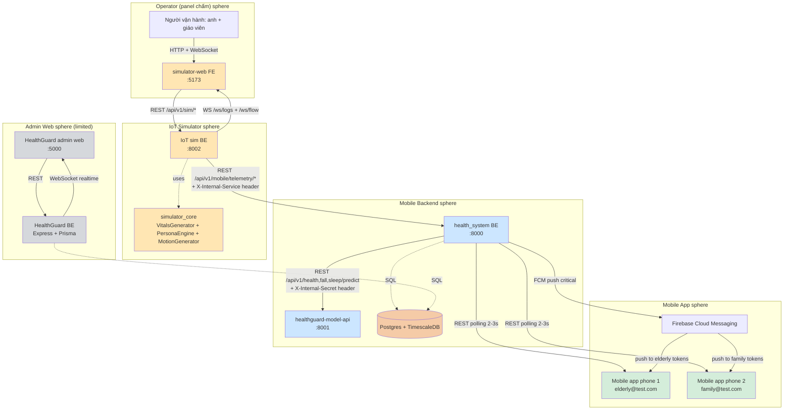
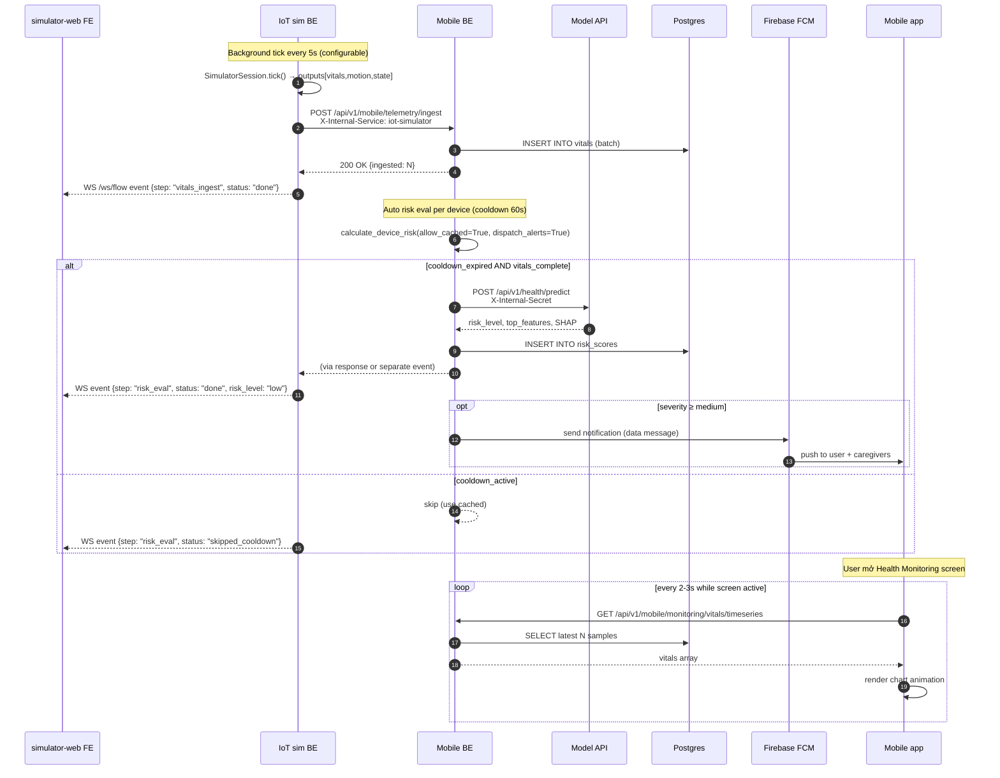
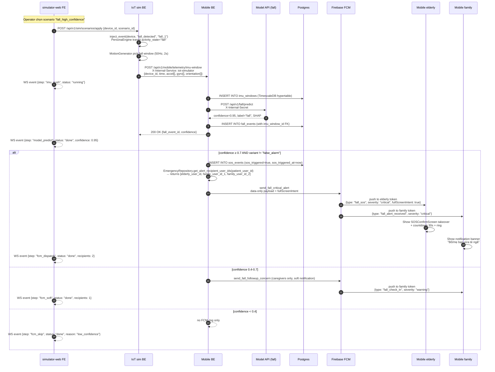
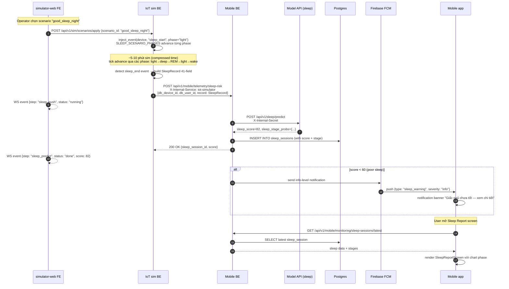
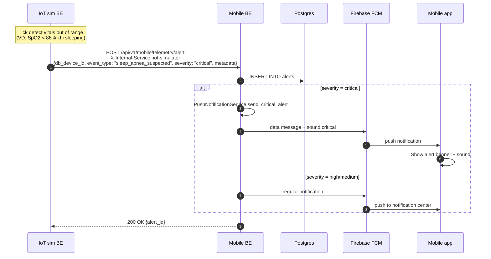

# Phase 2 — Target Topology

> **Goal:** Define rõ kiến trúc mục tiêu của VSmartwatch sau redesign — endpoint contract, sequence diagram, streaming pattern, simulator-web UX. Đây là blueprint cho Phase 3 (data contracts) + Phase 4 (ADRs) + Phase 7 (build).

**Phase:** P2 — Target Topology
**Date:** 2026-05-15
**Author:** Cascade
**Reviewer:** ThienPDM (pending)
**Status:** 🟡 In Progress v0.1
**Charter:** `00_charter.md` v1.0
**Inventory:** `01_current_state.md` v1.0
**Brainstorm decisions:** B1 (HTTP migration) + B2 (Pattern Unified) + B3 (Mid scope simulator-web UX)

---

## 1. Brainstorm decisions ghi nhận

| Brainstorm | Decision | ADR sẽ tạo |
|---|---|---|
| **B1 — Vitals path** | HTTP migration: IoT sim → `POST /api/v1/mobile/telemetry/ingest` (reverse ADR-013) | **ADR-020** |
| **B2 — Fall + Sleep flow** | Pattern Unified: tất cả qua BE → model-api (no direct call từ IoT sim) | **ADR-019** |
| **B3 — Simulator-web UX** | Mid scope: chips + sequence diagram live + multi-device + demo mode toggle | (không cần ADR, là UX scope) |

Kết hợp với **5 OQ đã chốt từ Charter:**
- OQ1: `/api/v1/mobile/*` endpoint prefix (ADR-021 execute ADR-004)
- OQ2: TimescaleDB `imu_windows` table TTL 7 ngày
- OQ3: Hybrid full-screen takeover cho fall critical
- OQ4: 2 mobile device song song (elderly + family linked)
- OQ5: BE auto-trigger risk inference

---

## 2. Target architecture — high-level



**Color legend:**
- 🟠 Orange — IoT Simulator (Anh quản lý)
- 🔵 Blue — Mobile Backend + Model API (server-side)
- 🟢 Green — Mobile App (elderly + family)
- 🟤 Brown — Database
- ⚪ Gray — Admin web (limited scope)

---

## 3. Endpoint contract overview (target)

### 3.1 IoT sim → mobile BE (4 outbound endpoints)

| Method | Path | Auth | Purpose | Trigger pattern |
|---|---|---|---|---|
| POST | `/api/v1/mobile/telemetry/ingest` | `X-Internal-Service: iot-simulator` | Vitals batch push | Tick-driven (5s default) |
| POST | `/api/v1/mobile/telemetry/imu-window` | Same | Fall IMU window push | Event-driven (motion peak) |
| POST | `/api/v1/mobile/telemetry/sleep-risk` | Same | Sleep session push | Period-end (wake event) |
| POST | `/api/v1/mobile/telemetry/alert` | Same | Direct alert (vitals OOR, sleep apnea suspected) | Rule-engine triggered |

**Disposed paths:**
- ~~`/api/v1/mobile/risk/calculate`~~ (OQ5 dispose) — BE auto-trigger sau ingest
- ~~`/api/v1/mobile/telemetry/sleep`~~ (deprecated by `/sleep-risk` which includes prediction)
- ~~Direct `:8001/api/v1/{fall,sleep}/predict`~~ (B2 dispose)

### 3.2 IoT sim → mobile BE admin (device CRUD)

| Method | Path | Auth | Purpose |
|---|---|---|---|
| POST | `/api/v1/mobile/admin/devices` | Internal | Create device for sim |
| POST | `/api/v1/mobile/admin/devices/{id}/link-user` | Internal | Link device to user |
| GET | `/api/v1/mobile/admin/devices` | Internal | List devices |
| DELETE | `/api/v1/mobile/admin/devices/{id}` | Internal | Remove device |

### 3.3 Mobile BE → model-api (3 endpoints, internal-only)

| Method | Path | Auth | Purpose |
|---|---|---|---|
| POST | `/api/v1/health/predict` | `X-Internal-Secret` | Risk inference (vitals batch) |
| POST | `/api/v1/fall/predict` | Same | Fall detection (IMU window) |
| POST | `/api/v1/sleep/predict` | Same | Sleep score (sleep session) |

### 3.4 Mobile app → mobile BE (consumer endpoints)

| Method | Path | Auth | Purpose | Polling? |
|---|---|---|---|---|
| GET | `/api/v1/mobile/monitoring/vitals/timeseries` | JWT | Vitals chart | 2-3s khi mở Health Monitoring |
| GET | `/api/v1/mobile/monitoring/analysis/risk-reports` | JWT | Risk reports list | On-demand |
| GET | `/api/v1/mobile/monitoring/analysis/risk-reports/{id}` | JWT | Risk detail | On-demand |
| POST | `/api/v1/mobile/risk/recalculate` | JWT | Force risk recalc | On-demand "Tính lại" button |
| GET | `/api/v1/mobile/relationships/dashboard` | JWT | Family linked dashboard | On-demand |
| POST | `/api/v1/mobile/notifications/push-token` | JWT | Register FCM token | Lifecycle |
| GET | `/api/v1/mobile/notifications` | JWT | Notification list | On-demand |

### 3.5 IoT sim FE → IoT sim BE (operator endpoints)

| Method | Path | Auth | Purpose |
|---|---|---|---|
| POST | `/api/v1/sim/scenarios/apply` | Admin API key (dev: none) | Apply scenario |
| POST | `/api/v1/sim/sessions` | Same | Create session |
| POST | `/api/v1/sim/sessions/{id}/start` | Same | Start session |
| POST | `/api/v1/sim/sessions/{id}/stop` | Same | Stop session |
| GET | `/api/v1/sim/sessions/{id}/fall-state` | Same | Poll fall countdown |
| GET | `/api/v1/sim/devices` | Same | List devices |
| GET | `/api/v1/sim/health` | None | Sim health check |
| WS | `/ws/logs/{session_id}` | None (dev) | Log stream |
| WS | `/ws/flow/{session_id}` ✨ NEW | None (dev) | Flow event stream (sequence diagram live) |

---

## 4. Sequence diagrams — 4 target flows

### 4.1 Flow Vitals (continuous tick-driven)



### 4.2 Flow Fall (event-driven IMU window)



### 4.3 Flow Sleep (period-end batch)



### 4.4 Flow Risk Direct Alert (vitals_out_of_range, sleep_apnea)



---

## 5. Streaming pattern detail (mobile + admin)

### 5.1 Mobile app pattern (FCM + REST polling, đã chốt Charter)

**Three modes per screen:**

| Screen | Pattern | Reason |
|---|---|---|
| **Home Dashboard** | Open: poll `/relationships/dashboard` mỗi 5s; Background: nothing | Active screen update mượt, idle save battery |
| **Health Monitoring (vitals chart)** | Open: poll `/monitoring/vitals/timeseries` mỗi 2-3s với `.autoDispose`; Background: nothing | Realtime chart cần fluid update |
| **Risk Report List** | Open: poll `/analysis/risk-reports` mỗi 10s; Background: nothing | Less frequent update OK |
| **Risk Report Detail** | Open: 1 fetch + manual refresh button; Background: nothing | Static-ish data |
| **Sleep Report** | Open: 1 fetch + manual refresh button; Background: nothing | Sleep data đã batch |
| **Family Linked Dashboard** | Open: poll `/relationships/dashboard` mỗi 5s; Background: nothing | Family theo dõi realtime |
| **Notifications** | FCM-driven; open: refresh `/notifications` | FCM wake app |
| **SOS Confirm (fall takeover)** | FCM-driven, fullScreenIntent | Critical, OS-level |

**Implementation pattern Flutter (Riverpod):**

```dart
// Pattern: autoDispose StreamProvider for polling
final vitalsTimeseriesProvider = StreamProvider.autoDispose<List<VitalSample>>((ref) {
  return Stream.periodic(
    Duration(seconds: 3),
    (_) => ref.read(monitoringRepoProvider).fetchTimeseries(),
  ).asyncMap((future) => future);
});

// Pattern: FCM handler for critical events
class FcmHandler {
  Future<void> onMessage(RemoteMessage message) async {
    if (message.data['type'] == 'fall_sos' && 
        message.data['severity'] == 'critical') {
      await _localNotifications.show(
        id,
        title,
        body,
        NotificationDetails(
          android: AndroidNotificationDetails(
            'fall_critical_channel',
            importance: Importance.max,
            fullScreenIntent: true,  // OQ3 hybrid takeover
            sound: RawResourceAndroidNotificationSound('alarm'),
          ),
        ),
      );
      // Navigate to SOSConfirmScreen
      _router.go('/sos/confirm', extra: message.data);
    }
  }
}

// Pattern: Demo mode toggle (env-controlled)
class PollingConfig {
  static Duration vitalsInterval() {
    final demoMode = dotenv.env['DEMO_MODE'] == 'true';
    return Duration(seconds: demoMode ? 1 : 3);
  }
}
```

### 5.2 Admin web pattern (WebSocket)

WebSocket cho ops dashboard:
- Connect: `ws://localhost:5000/api/v1/admin/ws/realtime`
- Channels: vitals updates, alerts stream, fall events, device heartbeat
- Reconnect logic: exponential backoff (1s → 2s → 4s → 8s → 16s, max)

Em **không deep-dive admin** trong Phase 2 vì scope hạn chế (xem Charter section 3.4).

### 5.3 Simulator-web pattern (WebSocket existing + NEW flow events)

**Existing WebSocket:**
- `/ws/logs/{session_id}` — device log stream

**NEW WebSocket (Phase 2 add):**
- `/ws/flow/{session_id}` — flow event stream cho sequence diagram live

Flow event payload schema:

```typescript
type FlowEvent = {
  ts: string;              // ISO timestamp
  session_id: string;
  device_id: string;
  step: FlowStep;          // "vitals_ingest" | "risk_eval" | "imu_push" | "model_predict" | "fcm_dispatch" | ...
  status: "pending" | "running" | "done" | "error" | "skipped";
  payload?: {
    duration_ms?: number;
    ack_status?: number;
    error?: string;
    risk_level?: string;
    confidence?: number;
    recipients?: number;
  };
};
```

---

## 6. Simulator-web UX target (B3 Mid scope)

### 6.1 Session Runner page wireframe

```
┌─────────────────────────────────────────────────────────────────────────┐
│  Session Runner — Demo Mode [Off|On]    Speed: ●○○ (1x)    Push: ●live │
├──────────────────────────┬──────────────────────────────────────────────┤
│  ELDERLY DEVICE          │   FAMILY DEVICE (read-only)                  │
│  ┌────────────────────┐  │   ┌────────────────────┐                    │
│  │ ID: SIM-001         │  │   │ Linked to SIM-001  │                    │
│  │ User: elderly@test  │  │   │ User: family@test  │                    │
│  │ Battery: 87%        │  │   │ Last FCM: 12s ago  │                    │
│  │ Scenario:           │  │   │ Last alert: ✓     │                    │
│  │ [Pick ▼] [Apply]    │  │   └────────────────────┘                    │
│  │ Last tick: 2s ago   │  │                                              │
│  └────────────────────┘  │                                              │
├──────────────────────────┴──────────────────────────────────────────────┤
│  FLOW SEQUENCE DIAGRAM (live)                                            │
│                                                                          │
│   IoT sim ──HTTP──▶ Mobile BE ──HTTP──▶ Model API ──▶ DB ──FCM──▶ Phone │
│      ●          ●            ●              ●        ●         ●         │
│   (pulsing)  (highlighted) (running)     (done)   (done)    (pending)   │
│                                                                          │
│   Mermaid render with animation                                          │
├─────────────────────────────────────────────────────────────────────────┤
│  STATUS CHIPS (rolling 10 latest events)                                 │
│  ✅ Vitals batch sent → 200 OK (45ms)                                    │
│  ✅ Risk eval triggered (cooldown OK) → MA call (210ms)                  │
│  ✅ Risk LOW, no alert                                                   │
│  ✅ Vitals chart updated on mobile (poll 3s)                             │
│  🟡 Fall window pushed → MA predict (310ms) — running                    │
└─────────────────────────────────────────────────────────────────────────┘
```

### 6.2 Components mới (Phase 7 implement)

```
simulator-web/src/components/
├── sequence_diagram/
│   ├── SequenceDiagramLive.tsx     # Mermaid render với highlight active node
│   ├── FlowStepNode.tsx             # Single node component
│   └── useSequenceFlow.ts           # State hook track flow execution
├── status_chips/
│   ├── StatusChipsRoll.tsx          # Rolling 10 latest events
│   └── StatusChipItem.tsx           # Single chip render
├── multi_device/
│   ├── ElderlyDevicePanel.tsx       # Apply scenario, vitals card
│   ├── FamilyDevicePanel.tsx        # Read-only mirror + FCM status
│   └── LinkedProfileCoordinator.tsx # Orchestrate 2 panel
└── demo_mode/
    └── DemoModeToggle.tsx           # Switch polling interval 3s → 1s
```

### 6.3 BE add (Phase 7 implement)

```python
# api_server/ws/flow_stream.py (NEW)
async def handle_ws_flow(websocket: WebSocket, session_id: str):
    await websocket.accept()
    runtime = get_runtime()
    queue = runtime.subscribe_flow_events(session_id)
    try:
        while True:
            event = await queue.get()
            await websocket.send_json(event)
    finally:
        runtime.unsubscribe_flow_events(session_id, queue)

# api_server/main.py (extend)
@app.websocket("/ws/flow/{session_id}")
async def ws_flow(websocket: WebSocket, session_id: str) -> None:
    await handle_ws_flow(websocket, session_id)

# api_server/dependencies.py (extend SimulatorRuntime)
class SimulatorRuntime:
    def __init__(self):
        # ... existing init
        self._flow_event_subscribers: dict[str, list[asyncio.Queue]] = {}
    
    def publish_flow_event(self, session_id: str, event: dict):
        """Called from tick / push / response handlers."""
        subscribers = self._flow_event_subscribers.get(session_id, [])
        for queue in subscribers:
            try:
                queue.put_nowait(event)
            except asyncio.QueueFull:
                pass  # Drop if subscriber slow
```

---

## 7. Cross-repo data flow matrix — target state

| Data type | Producer | Consumer (intermediate) | Final consumer | Endpoint | Transport |
|---|---|---|---|---|---|
| Vitals tick | IoT sim | Mobile BE | Mobile app + Admin web | `/api/v1/mobile/telemetry/ingest` | HTTP POST batch |
| IMU window | IoT sim | Mobile BE → Model API | Mobile app (via FCM nếu critical) | `/api/v1/mobile/telemetry/imu-window` | HTTP POST event-driven |
| Sleep session | IoT sim | Mobile BE → Model API | Mobile app | `/api/v1/mobile/telemetry/sleep-risk` | HTTP POST period-end |
| Direct alert | IoT sim | Mobile BE | Mobile app (FCM) | `/api/v1/mobile/telemetry/alert` | HTTP POST event-driven |
| Risk score | Mobile BE (auto-trigger) | DB persist | Mobile app polling | `/api/v1/mobile/risk/latest` | DB → REST polling |
| Vitals chart | Mobile app polling | DB read-only | Mobile UI | `/api/v1/mobile/monitoring/vitals/timeseries` | REST GET 2-3s |
| Critical FCM | Mobile BE | Firebase | Mobile app push | (FCM cloud) | FCM data message |
| Flow event (demo) | IoT sim BE | WebSocket | simulator-web FE | `/ws/flow/{session_id}` | WebSocket stream |
| Sim log | IoT sim BE | WebSocket | simulator-web FE | `/ws/logs/{session_id}` | WebSocket stream |

---

## 8. Database schema target additions

### 8.1 New table `imu_windows` (OQ2 chốt)

```sql
-- Phase 4 migration SQL (preview)
CREATE TABLE imu_windows (
    time TIMESTAMPTZ NOT NULL,
    device_id BIGINT NOT NULL REFERENCES devices(id) ON DELETE CASCADE,
    fall_event_id BIGINT REFERENCES fall_events(id) ON DELETE SET NULL,
    accel JSONB NOT NULL,         -- [{x, y, z}, ...] 100 samples
    gyro JSONB NOT NULL,          -- [{x, y, z}, ...] 100 samples
    orientation JSONB,            -- [{pitch, roll, yaw}, ...] optional
    sample_rate_hz INT NOT NULL DEFAULT 50,
    duration_seconds REAL NOT NULL DEFAULT 2.0,
    created_at TIMESTAMPTZ NOT NULL DEFAULT NOW(),
    PRIMARY KEY (time, device_id)
);

-- TimescaleDB hypertable + policies (OQ2)
SELECT create_hypertable('imu_windows', 'time', chunk_time_interval => INTERVAL '1 day');
SELECT add_retention_policy('imu_windows', INTERVAL '7 days');
ALTER TABLE imu_windows SET (timescaledb.compress, timescaledb.compress_segmentby = 'device_id');
SELECT add_compression_policy('imu_windows', INTERVAL '1 day');

CREATE INDEX idx_imu_windows_device_time ON imu_windows (device_id, time DESC);
CREATE INDEX idx_imu_windows_fall_event ON imu_windows (fall_event_id) WHERE fall_event_id IS NOT NULL;
```

**Cost estimate:**
- 1 user × 100 fall event/day × ~3.6KB/window = 360KB/day
- 100 user = 36MB/day → 252MB/week (before compression)
- TimescaleDB compress 10:1 → ~25MB/week effective storage
- 7-day retention → bounded growth ~25MB rolling

### 8.2 Risk scores additions (HS-024 fix)

```sql
-- Phase 4 migration (preview)
ALTER TABLE risk_scores 
    ADD COLUMN is_synthetic_default BOOLEAN NOT NULL DEFAULT FALSE,
    ADD COLUMN defaults_applied JSONB;

-- defaults_applied schema:
-- {"heart_rate": false, "spo2": false, "blood_pressure_sys": true, ...}
-- → Mobile app knows which fields were filled with defaults
```

### 8.3 Indexes (target add)

```sql
-- Speed up vitals query for mobile polling
CREATE INDEX IF NOT EXISTS idx_vitals_device_time_desc 
    ON vitals (device_id, time DESC);

-- Speed up risk_scores latest fetch
CREATE INDEX IF NOT EXISTS idx_risk_scores_user_calculated 
    ON risk_scores (user_id, calculated_at DESC);
```

---

## 9. Drift resolution mapping (current → target)

| Drift item | Current state | Target state | Action |
|---|---|---|---|
| Endpoint prefix `/mobile/*` | IoT sim hits direct | `/api/v1/mobile/*` everywhere | ADR-021 execute ADR-004 |
| Vitals DB direct path | `_execute_pending_tick_publish` line 1011-1056 | HTTP `/api/v1/mobile/telemetry/ingest` | ADR-020 reverse ADR-013 |
| `HttpPublisher` dead code | Wired không invoke | Dispose | Phase 7 cleanup |
| `_trigger_risk_inference` | IoT sim push trigger | Dispose (BE auto-trigger) | OQ5 |
| `FallAIClient` direct call | Bypass BE | Dispose, use `/telemetry/imu-window` | ADR-019 |
| `SleepAIClient` direct call | Bypass BE | Dispose, use `/telemetry/sleep-risk` | ADR-019 |
| `MobileTelemetryClient` orphan | 0 caller | Wire vào runtime | Phase 7 |
| `SleepRiskDispatcher` orphan | 0 caller | Wire vào sleep flow | Phase 7 |
| FastAPI `root_path="/api/v1"` | Magic hack | Drop, mount router với prefix `/api/v1/mobile` | Phase 7 |
| HS-024 silent default fill | 4 critical fields fill silent | Reject record nếu critical NULL; flag `is_synthetic_default` | ADR-018 |
| XR-003 model-api validation gap | No Field constraints | Add `Field(ge=, le=)`, error codes | ADR-018 |
| `imu_windows` table missing | Không lưu raw window | New hypertable + retention + compression | Phase 4 SQL |
| Fall takeover UI | FCM regular | Hybrid full-screen + ring | OQ3 |
| Linked profile demo | Chưa wire 2 device | Setup 2 mobile + verify fanout | OQ4 |
| simulator-web demo UX | Basic chips | Sequence diagram live + multi-device + demo mode | B3 |

---

## 10. ADRs cần tạo Phase 4 (preview)

| ADR | Topic | Decision driver |
|---|---|---|
| **ADR-018** | Health input validation contract | Resolve HS-024 + XR-003 (silent default fill + missing validation) |
| **ADR-019** | IoT sim no direct model-api call | B2 unified pattern, OQ2/OQ5 |
| **ADR-020** | Vitals path migration (DB direct → HTTP) | B1, reverse ADR-013 |
| **ADR-021** | Endpoint prefix execution | OQ1, execute ADR-004 |
| **ADR-022** | IMU window persistence policy | OQ2 detail (TimescaleDB design) |
| **ADR-023** | Mobile streaming pattern (FCM + polling) | Charter section 3.2 |
| **ADR-024** | Simulator-web flow event WebSocket | B3 simulator UX |

---

## 11. Phase 2 acceptance criteria

- [x] B1, B2, B3 brainstorm decisions documented
- [x] Target architecture diagram (Mermaid)
- [x] 4 sequence diagrams target state (vitals, fall, sleep, direct alert)
- [x] Endpoint contract overview (5 surface)
- [x] Streaming pattern detail per layer
- [x] Simulator-web UX wireframe (Mid scope)
- [x] Cross-repo data flow matrix
- [x] DB schema target additions
- [x] Drift resolution mapping
- [x] 7 ADRs preview cho Phase 4

---

## 12. Open items for Phase 3 (Data Contracts)

1. **Vitals ingest payload schema** — required fields, optional, range, error code → `vitals_ingest.md`
2. **IMU window payload schema** — array shape, encoding, validation → `fall_imu_window.md`
3. **Sleep record 41-field schema** — full canonical definition → `sleep_session.md`
4. **Alert push payload schema** — event_type vocabulary, severity mapping, metadata structure → `alert_push.md`
5. **Risk trigger contract** — `is_synthetic_default` flag handling, defaults_applied JSON shape → `risk_trigger.md`

---

## 13. Changelog

| Version | Date | Author | Change |
|---|---|---|---|
| v0.1 | 2026-05-15 | Cascade | Initial draft target topology — 3 brainstorm decisions + 4 sequence diagrams + DB schema additions + drift resolution. Ready for ThienPDM review. |
