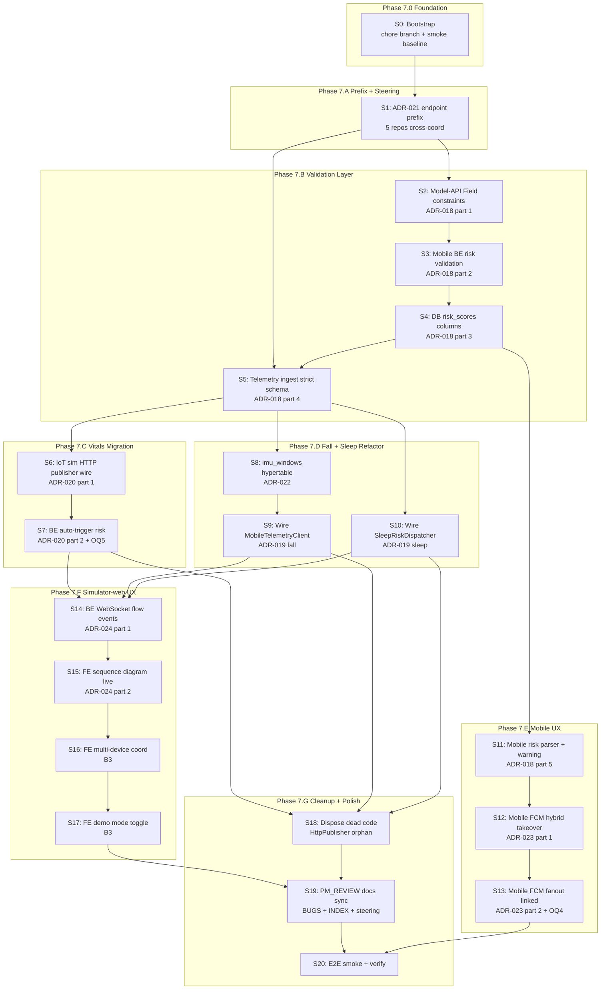

# Phase 5 — Migration Roadmap

> **Goal:** Break 56 gaps thành 15-20 vertical slices có thứ tự rõ. Mỗi slice ≤ 2 ngày effort, có dependency rõ, commit-per-slice. Đây là input cho Phase 7 build với `/build` workflow.

**Phase:** P5 — Migration Roadmap
**Date:** 2026-05-15
**Author:** Cascade
**Reviewer:** ThienPDM (pending)
**Status:** ✅ v1.0 Approved (2026-05-15)
**Inputs:** Gap Analysis v1.0 + 7 ADRs v1.0

---

## 1. Vertical slice principle

Mỗi slice phải:

1. **Self-contained** — có giá trị độc lập, có thể merge mà không break trunk
2. **Small** — ≤ 2 ngày effort (8-14h)
3. **Testable** — có acceptance criteria + test cases verifiable
4. **Atomic commit** — 1 PR per slice (hoặc 1 commit cluster nếu cross-repo)
5. **Reversible** — có rollback plan rõ

Anti-pattern em **không** làm:
- Big-bang refactor multiple repo cùng PR
- Slice depend trên slice chưa merge
- Slice > 2 ngày effort

---

## 2. Slice DAG

**Critical path:** S00 → S01 → S02 → S03 → S04 → S05 → S07 → S20 (8 slices, ~16-20 days sequential)

**Parallel opportunities:**
- After S05: S06 + S08 + S10 parallel
- After S04: S11 parallel với vitals migration
- After S14: S15 → S16 → S17 sequential (FE same codebase)

---

## 3. Slice breakdown

### Phase 7.0 Foundation

#### S0 — Bootstrap (Foundation)

**Goal:** Chuẩn bị môi trường + verify baseline trước khi refactor.

**Tasks:**
- Verify 5 repo trunk clean
- Snapshot smoke test baseline (vitals push works, risk eval works manual, FCM works)
- Create `chore/redesign-iot-sim-2026-bootstrap` branch nếu chưa có
- Document baseline metrics: tick latency, risk eval p95, FCM dispatch p95

**Effort:** S (1h)
**Risk:** Low
**Acceptance:**
- [ ] Snapshot baseline E2E test pass
- [ ] All 5 repos confirmed clean
- [ ] Branch created (this redesign already on `chore/redesign-iot-sim-2026`)

**Repos touched:** None (verify only)

---

### Phase 7.A Prefix + Steering

#### S1 — ADR-021 Endpoint Prefix Migration

**Goal:** Cross-repo prefix `/api/v1/{domain}/*` standardization.

**Sub-tasks:**

| Sub | Repo | File | Change |
|---|---|---|---|
| S1.1 | `health_system/backend` | `app/main.py:28` | Drop `root_path="/api/v1"`, update `docs_url` |
| S1.2 | `health_system/backend` | `app/api/router.py:17` | Change `APIRouter(prefix="/api/v1/mobile")` |
| S1.3 | `Iot_Simulator_clean/api_server` | `main.py:92-101` | 10 router includes prefix `/api/v1/sim` |
| S1.4 | `Iot_Simulator_clean/api_server` | `dependencies.py:911-923` | 3 endpoint URL builders update |
| S1.5 | `Iot_Simulator_clean/api_server` | `backend_admin_client.py:45` | `/api/v1/mobile/admin` |
| S1.6 | `Iot_Simulator_clean/api_server` | `services/sleep_service.py:587,645` | `/api/v1/mobile/telemetry/sleep` |
| S1.7 | `Iot_Simulator_clean/simulator-web` | FE config | API base URL update |
| S1.8 | PM_REVIEW | 5 copies of `.windsurf/rules/11-cross-repo-topology.md` | Sync prefix |

**Effort:** M (4-6h total across repos)
**Risk:** Medium (cross-repo)
**Acceptance:**
- [ ] `curl /api/v1/mobile/health` returns 200
- [ ] `curl /api/v1/sim/health` returns 200
- [ ] Old paths return 404
- [ ] Mobile app login + vitals fetch still works
- [ ] Existing IoT sim test suite pass (update mocked paths)
- [ ] XR-001 marked Resolved

**Repos touched:** All 5
**Commit pattern:** 5 commits across repos, coordinated merge

---

### Phase 7.B Validation Layer

#### S2 — Model-API Field Constraints (ADR-018 part 1)

**Goal:** Model-API reject out-of-range vitals.

**Tasks:**
- Update `healthguard-model-api/app/schemas/health.py` add `Field(ge=, le=)` for 10 fields
- Add Optional `is_synthetic_default: bool = False`
- Add Optional `defaults_applied: list[str] = []`
- Update response schema add `effective_confidence`, `data_quality_warning`
- Update `health_service.predict_health_risk` compute `effective_confidence`
- Add structured error response `{error: {code, message, details}}`
- Add tests: range validation, synthetic flag, structured error

**Effort:** M (3-4h)
**Risk:** Low (additive, backward-compat Optional)
**Acceptance:**
- [ ] POST `/predict` với `heart_rate=500` → 422 `VITALS_OUT_OF_RANGE`
- [ ] Response include `effective_confidence` field
- [ ] Old clients (no `is_synthetic_default`) still work (default False)
- [ ] New tests pass

**Repos touched:** `healthguard-model-api`

#### S3 — Mobile BE Risk Validation Refactor (ADR-018 part 2)

**Goal:** Mobile BE reject NULL critical vitals, track `defaults_applied`.

**Tasks:**
- `risk_alert_service._fetch_latest_vitals`: reject if any critical field NULL (HR, SpO2, RR, body_temp)
- `risk_alert_service._build_inference_payload`: track ALL fields, raise `InsufficientVitalsError` for critical NULL
- `model_api_health_adapter.to_record`: sync default values với Layer 1 (HRV 40)
- Add `InsufficientVitalsError` class
- Update `calculate_device_risk` return `RiskCalculationResult` dataclass
- Add tests

**Effort:** M (4-5h)
**Risk:** High (HS-024 fix critical path)
**Acceptance:**
- [ ] `test_reject_when_critical_vitals_null` pass
- [ ] `test_tracks_defaults_applied_for_soft_fields` pass
- [ ] `test_hrv_default_consistent_layer1_layer2` pass
- [ ] Existing tests still pass
- [ ] HS-024 bug status Verified (regression test added)

**Repos touched:** `health_system/backend`
**Depends on:** S2

#### S4 — DB risk_scores Columns Migration (ADR-018 part 3)

**Goal:** Add 4 new columns cho synthetic tracking.

**Tasks:**
- Migration file `20260515_risk_scores_synthetic.sql`:
  - ADD COLUMN `is_synthetic_default BOOLEAN DEFAULT FALSE`
  - ADD COLUMN `defaults_applied JSONB`
  - ADD COLUMN `effective_confidence NUMERIC(4,3)`
  - ADD COLUMN `data_quality_warning TEXT`
  - CREATE INDEX `idx_risk_scores_synthetic`
- Update SQLAlchemy `RiskScore` model
- Update `RiskScoreResponse` Pydantic schema
- Update existing test fixtures

**Effort:** S (1-2h)
**Risk:** Medium (DB migration, additive only)
**Acceptance:**
- [ ] Migration applied successfully
- [ ] ORM model match SQL
- [ ] Existing risk_scores rows have `is_synthetic_default=FALSE` (default)
- [ ] New risk_scores INSERT include new fields

**Repos touched:** `health_system/backend`
**Depends on:** S3

#### S5 — Telemetry Ingest Strict Schema (ADR-018 part 4)

**Goal:** `/telemetry/ingest` reject INSUFFICIENT_VITALS at boundary.

**Tasks:**
- `VitalIngestVitals` Pydantic: `extra="forbid"`, `Field(ge=, le=)` for 9 fields
- Add `INSUFFICIENT_VITALS` check: reject if HR AND SpO2 both NULL per item
- Return structured errors: `IngestError[]`
- Return `risk_evaluated_devices: number[]`
- Add `Idempotency-Key` dedup (in-memory or Redis)
- Update tests

**Effort:** M (3-4h)
**Risk:** High (breaking change for IoT sim test fixtures)
**Acceptance:**
- [ ] `test_reject_missing_critical_vitals` pass với 422 `INSUFFICIENT_VITALS`
- [ ] `test_reject_out_of_range_heart_rate` pass với 422 `OUT_OF_RANGE`
- [ ] `test_idempotency_dedup` pass
- [ ] IoT sim test suite still works (mock payload với valid vitals)

**Repos touched:** `health_system/backend`
**Depends on:** S2, S4

---

### Phase 7.C Vitals Migration

#### S6 — IoT Sim HTTP Vitals Publisher (ADR-020 part 1)

**Goal:** IoT sim push vitals qua HTTP thay DB direct.

**Tasks:**
- Update `_execute_pending_tick_publish` (`dependencies.py:1003-1056`):
  - Build payload theo `VitalIngestRequest` schema
  - Call `self._http_sender(endpoint, payload, headers)` thay `db.execute(INSERT...)`
  - Handle response parse `ingested` count
  - Update `last_publish_*` tracking
- Update `_telemetry_ingest_endpoint` (`:911`) return `/api/v1/mobile/telemetry/ingest`
- Feature flag `USE_HTTP_VITALS_PUBLISH=true` for transitional toggle
- Update IoT sim unit tests (mock Mobile BE response)

**Effort:** M (4-5h)
**Risk:** Medium (vitals critical path)
**Acceptance:**
- [ ] Tick publish gửi HTTP, không DB direct
- [ ] Smoke test: tick 5s → mobile vitals timeseries update
- [ ] Feature flag toggle works
- [ ] Existing tests pass (update mocks)

**Repos touched:** `Iot_Simulator_clean`
**Depends on:** S5

#### S7 — BE Auto-Trigger Risk + Dispose IoT Risk Path (OQ5)

**Goal:** Verify BE auto-trigger risk works after S6 HTTP migration. Dispose IoT sim risk trigger code.

**Tasks:**
- Verify `routes/telemetry.py:325-333` auto-call `calculate_device_risk` after ingest
- Verify cooldown 60s respect
- Dispose `dependencies.py:1206-1237` `_trigger_risk_inference`
- Dispose `dependencies.py:921-923` `_risk_calculate_endpoint`
- Dispose orchestrator R3 wire
- Update tests

**Effort:** M (2-3h)
**Risk:** Low (just remove code + verify auto path)
**Acceptance:**
- [ ] IoT sim không gọi `/risk/calculate` nữa
- [ ] Mobile app risk score update sau vitals push (cooldown 60s)
- [ ] E2E test scenario `tachycardia_warning` → mobile risk banner

**Repos touched:** `Iot_Simulator_clean`, `health_system/backend` (verify)
**Depends on:** S6

---

### Phase 7.D Fall + Sleep Refactor

#### S8 — imu_windows Hypertable (ADR-022)

**Goal:** DB schema cho IMU raw persistence.

**Tasks:**
- Migration `20260515_imu_windows_hypertable.sql`:
  - CREATE TABLE
  - create_hypertable, retention policy 7 days, compression policy 1 day
  - Add FK `fall_events.imu_window_id`
- Add SQLAlchemy `ImuWindow` model
- Update `/telemetry/imu-window` handler INSERT imu_windows
- Add tests

**Effort:** M (2-3h)
**Risk:** Medium (DB migration TimescaleDB)
**Acceptance:**
- [ ] Table created with hypertable
- [ ] Retention + compression policies active (verify `timescaledb_information.jobs`)
- [ ] INSERT works qua handler
- [ ] FK `fall_events.imu_window_id` work

**Repos touched:** `health_system/backend`
**Depends on:** S5

#### S9 — Wire MobileTelemetryClient (ADR-019 fall)

**Goal:** Dispose `FallAIClient` direct, wire orphan client.

**Tasks:**
- Inject `MobileTelemetryClient` vào `SimulatorRuntime.__init__`
- Replace `FallAIClient.predict()` call sites (`dependencies.py:1570`)
- Update response handling: parse `fall_event_id`, `confidence` from BE response
- Update `_fall_predictions` cache same shape
- Update test suite (mock Mobile BE instead of model-api)

**Effort:** M (3-4h)
**Risk:** Medium (fall flow critical for demo)
**Acceptance:**
- [ ] Fall scenario apply → IoT sim push IMU window via HTTP
- [ ] BE INSERT imu_windows + fall_events
- [ ] FE poll `/sessions/{id}/fall-state` still get verdict
- [ ] FCM dispatched to 2 mobile devices

**Repos touched:** `Iot_Simulator_clean`
**Depends on:** S5, S8

#### S10 — Wire SleepRiskDispatcher (ADR-019 sleep)

**Goal:** Dispose `SleepAIClient` direct, wire orphan dispatcher.

**Tasks:**
- Construct `SleepRiskDispatcher` với `MobileTelemetryClient` trong `sleep_service`
- Replace `SleepAIClient.predict()` call sites
- Update `_post_sleep_payload` use dispatcher path `/api/v1/mobile/telemetry/sleep-risk`
- Update tests

**Effort:** M (2-3h)
**Risk:** Low (less critical than fall demo)
**Acceptance:**
- [ ] Sleep scenario apply → IoT sim push sleep record via HTTP
- [ ] BE call model-api sleep predict + INSERT sleep_sessions
- [ ] Mobile sleep report show score + quality

**Repos touched:** `Iot_Simulator_clean`, `health_system/backend` (verify endpoint)
**Depends on:** S5

---

### Phase 7.E Mobile UX

#### S11 — Mobile Risk Parser + Warning Banner (ADR-018 part 5)

**Goal:** Mobile app consume `is_synthetic_default` + render warning.

**Tasks:**
- Update `RiskReportEntity` parser: add 4 new fields
- Update `RiskReportDetailScreen`: render orange warning banner conditional
- Update unit tests for parser
- Vietnamese copy: "Một số chỉ số được ước tính..."

**Effort:** M (3-4h)
**Risk:** Low (additive)
**Acceptance:**
- [ ] Mobile parse `is_synthetic_default=true` → show banner
- [ ] Mobile parse `defaults_applied` → list field names
- [ ] Mobile parse `effective_confidence` → show degraded confidence
- [ ] Existing tests pass

**Repos touched:** `health_system/lib` (mobile FE)
**Depends on:** S4

#### S12 — Mobile FCM Hybrid Takeover (ADR-023 part 1 + OQ3)

**Goal:** Critical fall alert wake screen + full-screen takeover.

**Tasks:**
- Update `FcmHandler` parse data-only message
- Update `_showFullScreenSos` use `fullScreenIntent: true`
- Update AndroidManifest add `USE_FULL_SCREEN_INTENT` permission
- Update Activity `android:showWhenLocked="true"`, `turnScreenOn="true"`
- Register notification channels: `fall_critical_channel`, `vitals_warning_channel`, `info_channel`
- iOS: `interruption-level: critical`
- Update navigation route to `SOSConfirmScreen`

**Effort:** L (5-6h, includes Android setup)
**Risk:** Medium (real device testing required)
**Acceptance:**
- [ ] FCM với `type=fall_sos, severity=critical, fullScreenIntent=true` → screen wake + takeover
- [ ] User tap notification → SOSConfirmScreen open
- [ ] Lock screen test pass on real Android device
- [ ] Vibration pattern correct

**Repos touched:** `health_system/lib`
**Depends on:** None (parallel với other phase 7.E)

#### S13 — Mobile FCM Fanout Linked Profile (ADR-023 part 2 + OQ4)

**Goal:** Setup 2 mobile device demo elderly + family linked.

**Tasks:**
- Verify `send_fall_critical_alert` fanout patient + caregivers (BE code already exists)
- Per-recipient payload: `is_recipient_patient` flag drive UI behavior
- Mobile handler: if patient → fullScreenIntent, if family → banner notification
- Setup 2 test user: `elderly@test.com`, `family@test.com` linked via `UserRelationship`
- Register FCM token cho cả 2
- E2E test 2 devices

**Effort:** M (3-4h)
**Risk:** Medium (real device 2 phones)
**Acceptance:**
- [ ] Fall scenario trigger → both phones receive FCM
- [ ] Elderly phone: full-screen takeover + ring
- [ ] Family phone: notification banner "Bố/mẹ té ngã"
- [ ] Both phones update visible to demo

**Repos touched:** `health_system/lib`, `health_system/backend` (verify fanout)
**Depends on:** S12

---

### Phase 7.F Simulator-web UX

#### S14 — BE WebSocket Flow Events (ADR-024 part 1)

**Goal:** Add `/ws/flow/{session_id}` channel + publish hooks.

**Tasks:**
- Add `api_server/ws/flow_stream.py` (handle_ws_flow)
- Update `main.py` add `@app.websocket("/ws/flow/{session_id}")`
- Update `SimulatorRuntime` add `_flow_subscribers`, `subscribe/unsubscribe`, `publish_flow_event`
- Add event emit points: tick publish, alert push, fall predict response, sleep predict response
- Update tests

**Effort:** M (3-4h)
**Risk:** Low
**Acceptance:**
- [ ] WebSocket connect to `/ws/flow/test-session` works
- [ ] Tick publishes emit `vitals_ingest` event
- [ ] Alert push emit `alert_push` event
- [ ] Fall predict emit `imu_predict` event
- [ ] Multi-subscriber support (operator + panel chấm cùng connect)

**Repos touched:** `Iot_Simulator_clean`
**Depends on:** S7, S9, S10 (event emit hooks at those code paths)

#### S15 — FE Sequence Diagram Live (ADR-024 part 2)

**Goal:** Mermaid render live trên simulator-web.

**Tasks:**
- Install `mermaid` npm package
- Add `MermaidRenderer.tsx` component
- Add `useSequenceFlow.ts` hook consume WebSocket
- Add `SequenceDiagramLive.tsx` component
- Add `FlowStepNode.tsx`
- Update `SessionRunnerPage.tsx` integrate
- Style: highlight active node với CSS

**Effort:** L (5-6h)
**Risk:** Low
**Acceptance:**
- [ ] Mermaid render từ flow events
- [ ] Active step highlight in different color
- [ ] Auto-clear highlight after 500ms
- [ ] Rolling window 100 latest events

**Repos touched:** `Iot_Simulator_clean/simulator-web`
**Depends on:** S14

#### S16 — FE Multi-Device Coordinator (B3 + OQ4)

**Goal:** Elderly + family panel side-by-side.

**Tasks:**
- Add `LinkedProfileCoordinator.tsx`
- Add `ElderlyDevicePanel.tsx` (apply scenario, vitals card)
- Add `FamilyDevicePanel.tsx` (read-only mirror, FCM status display)
- Wire backend admin link 2 user accounts demo
- Update routing/layout

**Effort:** M (3-4h)
**Risk:** Low
**Acceptance:**
- [ ] Panel UI shows 2 side-by-side cards
- [ ] Family panel updates when elderly receives alert (poll BE)
- [ ] FCM status indicator (last received timestamp)

**Repos touched:** `Iot_Simulator_clean/simulator-web`
**Depends on:** S15

#### S17 — FE Demo Mode Toggle (B3)

**Goal:** Toggle polling 3s ↔ 1s, tick 5s ↔ 1s.

**Tasks:**
- Add `DemoModeToggle.tsx` component
- Add `POST /api/v1/sim/settings/demo-mode` endpoint
- BE: update `tick_interval` runtime
- Mobile FE: read `DEMO_MODE` env, swap polling intervals
- Persist demo mode state (session storage)

**Effort:** S (1-2h)
**Risk:** Low
**Acceptance:**
- [ ] Toggle on → tick 1s + polling 1s
- [ ] Toggle off → tick 5s + polling 3s
- [ ] State persist across page reload

**Repos touched:** `Iot_Simulator_clean/simulator-web`, `Iot_Simulator_clean/api_server`, `health_system/lib`
**Depends on:** S16

---

### Phase 7.G Cleanup + Polish

#### S18 — Dispose Dead Code

**Goal:** Cleanup orphan + dead code identified Phase 1.

**Tasks:**
- Remove `HttpPublisher` + `transport_router.http` wiring (dead code)
- Keep `FallAIClient` + `SleepAIClient` class files (utility/debug), but mark deprecated
- Remove `_trigger_risk_inference` + `_risk_calculate_endpoint` (already disposed S7)
- Remove orchestrator R3 wire fix
- Remove FastAPI `root_path` (already done S1)
- Update IoT sim init log to confirm clean wiring

**Effort:** S (1-2h)
**Risk:** Low
**Acceptance:**
- [ ] `grep HttpPublisher in api_server/` = 0 hit (removed)
- [ ] `grep _trigger_risk_inference` = 0 hit
- [ ] Tests still pass
- [ ] No regression

**Repos touched:** `Iot_Simulator_clean`
**Depends on:** S7, S9, S10

#### S19 — PM_REVIEW Docs Sync

**Goal:** Update bug + ADR + steering docs.

**Tasks:**
- Update `PM_REVIEW/BUGS/HS-024-*.md` status `✅ Resolved`, link fix commit
- Update `PM_REVIEW/BUGS/XR-001-*.md` Resolved
- Update `PM_REVIEW/BUGS/XR-003-*.md` Resolved
- Update `PM_REVIEW/BUGS/INDEX.md`
- Update `PM_REVIEW/ADR/INDEX.md` register 7 new ADRs (ADR-018 to ADR-024)
- Update `PM_REVIEW/ADR/013-iot-direct-db-vitals.md` status `⚫ Superseded` link ADR-020
- Update `PM_REVIEW/AUDIT_2026/tier1/topology_v2.md` D-019 Resolved
- Update `PM_REVIEW/AUDIT_2026/tier1/api_contract_v1.md` new prefix

**Effort:** S (1-2h)
**Risk:** Low (docs only)
**Acceptance:**
- [ ] All bug entries updated
- [ ] ADR INDEX has 7 new entries
- [ ] ADR-013 marked Superseded
- [ ] Steering sync to reality

**Repos touched:** `PM_REVIEW`
**Depends on:** S18

#### S20 — E2E Smoke + Verify

**Goal:** Full E2E acceptance test demo flow.

**Tasks:**
- Run demo flow end-to-end:
  1. Start IoT sim BE + Mobile BE + model-api + 2 mobile emulators
  2. Apply scenario `tachycardia_warning` → verify mobile risk banner
  3. Apply scenario `hypoxia_critical` → verify FCM + 2 phones receive
  4. Apply scenario `fall_high_confidence` → verify SOSConfirmScreen takeover trên elderly + banner trên family
  5. Apply scenario `good_sleep_night` → verify sleep report
- Verify simulator-web sequence diagram live, status chips, multi-device panel
- Verify demo mode toggle
- Update redesign Charter section 5 acceptance criteria checkboxes
- Create final phase report

**Effort:** M (3-4h)
**Risk:** Low (verification phase)
**Acceptance:**
- [ ] All 4 demo scenarios pass
- [ ] Charter acceptance criteria 100% checked
- [ ] Phase 7 report committed

**Repos touched:** All (verify only)
**Depends on:** S19

---

## 4. Phase 7 timeline

| Week | Slices | Cumulative effort | Note |
|---|---|---|---|
| Week 1 | S0, S1 | ~6h | Foundation + prefix migration |
| Week 2 | S2, S3, S4, S5 | ~15h | Validation layer (ADR-018) |
| Week 3 | S6, S7 | ~7h | Vitals HTTP migration |
| Week 4 | S8, S9, S10 | ~10h | Fall + sleep refactor (ADR-019) |
| Week 5 | S11, S12, S13 | ~14h | Mobile UX (banner + FCM + linked) |
| Week 6 | S14, S15 | ~10h | BE WS + FE Mermaid live |
| Week 7 | S16, S17, S18 | ~7h | Multi-device + demo mode + cleanup |
| Week 8 | S19, S20 | ~5h | Docs sync + E2E smoke |
| **Total** | **20 slices** | **~74h** | **8 weeks @ ~9h/week** |

**Match Charter timeline 1-2 tháng:** ✅ 8 weeks fits 2 tháng comfortably.

---

## 5. Slice acceptance pattern (template)

Mỗi slice phải pass:
- [ ] Code change implements ADR/contract spec
- [ ] Unit tests added (TDD red-green-refactor)
- [ ] Integration test pass (nếu cross-layer)
- [ ] Manual smoke test trên dev env
- [ ] Backward compat verified (existing tests pass)
- [ ] PR description link tới slice + ADR + contract
- [ ] Commit message tiếng Việt (rule operating-mode)

---

## 6. Rollback strategy

Mỗi slice có rollback plan:

| Slice category | Rollback method |
|---|---|
| DB migrations (S4, S8) | Migration `DROP COLUMN` / `DROP TABLE` script |
| Code refactor (S3, S6, S9, S10) | Git revert PR + redeploy |
| Schema validation (S2, S5) | Loosen Field constraints back to `extra="allow"` |
| Endpoint prefix (S1) | Dual-mount transitional (add old paths back temporarily) |
| Mobile UX (S11-S13) | Feature flag conditional render |
| Simulator-web (S14-S17) | Hide new components behind env flag |

---

## 7. Risk + mitigation per critical path slice

| Slice | Risk | Mitigation |
|---|---|---|
| S1 prefix | Mobile app/IoT sim break sau deploy | Dual-mount transitional 1 deploy, verify smoke |
| S3 HS-024 fix | Existing test break | Update test fixtures provide complete vitals |
| S5 strict schema | IoT sim push fail | Coordinate với S6 same PR |
| S6 vitals HTTP | Tick latency increase | Feature flag toggle, monitor p95 |
| S9 fall AI | FE poll `/sessions/{id}/fall-state` fail | Keep cache shape identical |
| S12 FCM hybrid | Real device behavior unknown | Test on Android 14+ phone before merge |
| S13 fanout 2 phone | FCM delivery failure to caregiver | Verify token register flow, retry logic |

---

## 8. Definition of Done (DoD) for entire Phase 7

- [ ] All 8 Critical gaps fixed
- [ ] All 24 High gaps fixed
- [ ] Medium + Low gaps cherry-picked based on time
- [ ] 3 bugs (HS-024, XR-001, XR-003) marked ✅ Resolved
- [ ] 7 ADRs marked 🟢 Accepted
- [ ] Charter section 5 acceptance criteria 100% checked
- [ ] Demo flow E2E pass with 2 mobile devices
- [ ] Panel chấm demo dry-run successful
- [ ] PM_REVIEW docs sync complete

---

## 9. Changelog

| Version | Date | Author | Change |
|---|---|---|---|
| v0.1 | 2026-05-15 | Cascade | Initial roadmap 20 slices, 8 weeks, ~74h effort |
