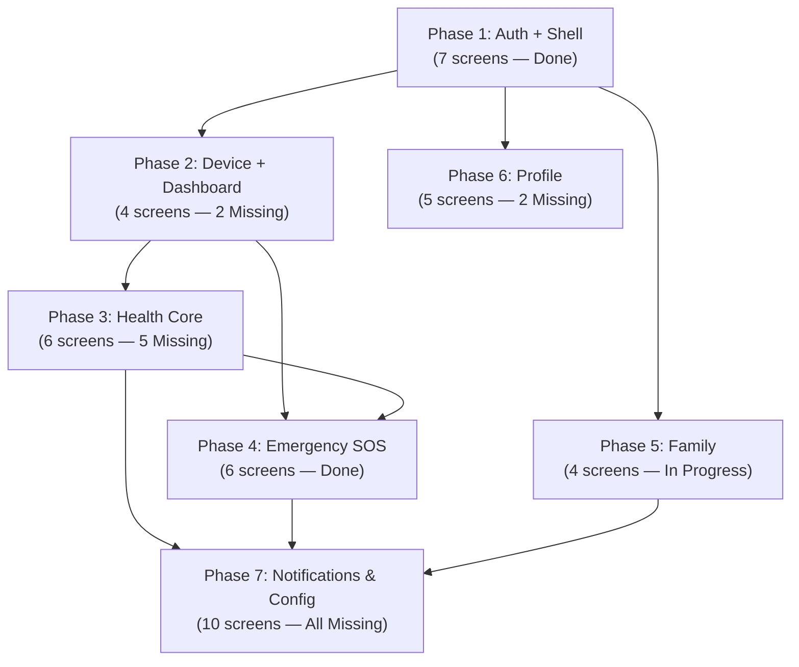

# Phase Build Order — HealthGuard Mobile

> Last updated: 2026-03-16
> Thứ tự build màn hình theo dependency — không test được phase sau nếu chưa xong phase trước.

---

## Dependency Flow



---

## Phase Index

| Phase | Tên | Screens | Spec Status | Build Order |
| --- | --- | --- | --- | --- |
| **1** | Shell & Auth | AUTH_Splash, Login, Register, VerifyEmail, ForgotPassword, ResetPassword, Bottom Nav | Done | 1 |
| **2** | Device + Dashboard | DEVICE_List, DEVICE_Connect, DEVICE_StatusDetail, HOME_Dashboard | 2 Missing | 2 |
| **3** | Health Core | MONITORING_VitalDetail, MONITORING_HealthHistory, SLEEP_Report, SLEEP_Detail, ANALYSIS_RiskReport, ANALYSIS_RiskReportDetail | 5 Missing | 3 |
| **4** | Emergency SOS | ManualSOS, LocalSOSActive, FallAlert, IncomingSOSAlarm, SOSReceivedList, SOSReceivedDetail | Done | 4 |
| **5** | Family | PROFILE_ContactList, PROFILE_AddContact, PROFILE_LinkedContactDetail, HOME_FamilyDashboard | In Progress | 5 |
| **6** | Profile | PROFILE_Overview, PROFILE_EditProfile, PROFILE_MedicalInfo, PROFILE_ChangePassword, PROFILE_DeleteAccount | 2 Missing | 6 |
| **7** | Notifications & Config | 10 screens (NOTIFICATION_*, SLEEP_History, SLEEP_TrackingSettings, ANALYSIS_RiskHistory, DEVICE_Configure, AUTH_Onboarding) | All Missing | 7 |

---

## Build Order Rules

1. **Phase 1** — Blocking: Không test được gì nếu chưa có Login + Bottom Nav.
2. **Phase 2** — Blocking: Không có data nếu chưa có thiết bị. HOME_Dashboard phải handle `No_Device` state.
3. **Phase 3** — Core value: Lý do user dùng app mỗi ngày. Drill-down nhận `profileId` qua route.
4. **Phase 4** — Safety critical: Build song song hoặc ngay sau Phase 3. Không delay.
5. **Phase 5** — Prerequisite cho FamilyDashboard: Cần linked contacts trước.
6. **Phase 6** — Quality of life: Không blocking. Build sau khi core ổn định.
7. **Phase 7** — Polishing: Thêm cuối cùng. AUTH_Onboarding không blocking.

---

## Cách dùng Phase Prompts

Mỗi file `Phase[N]_*.md` chứa:

1. **Phase Goal** — Mục tiêu phase
2. **Dependency Matrix** — Cần gì từ phase trước
3. **Multi-Agent Brainstorming Block** — Review points (Skeptic / Constraint Guardian / User Advocate)
4. **TASK Prompt** — Copy-paste command cho `@mobile-agent mode TASK`
5. **Acceptance Gate** — Điều kiện DONE trước khi sang phase sau

Chạy lần lượt Phase 1 → Phase 7. Không skip phase.

---

## File Structure

```
BUILD_PHASES/
├── README.md              ← This file
├── Phase1_Auth.md
├── Phase2_Device.md
├── Phase3_HealthCore.md
├── Phase4_Emergency.md
├── Phase5_Family.md
├── Phase6_Profile.md
└── Phase7_Notifications.md
```

Screen specs vẫn nằm flat tại `../Screen/[MODULE]_[ScreenName].md` (theo convention của mobile-agent).
