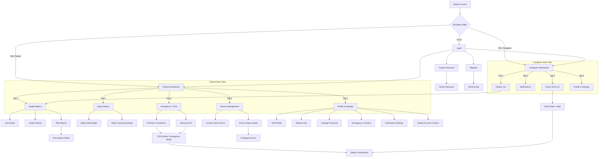

# 📱 Screen Index — HealthGuard Mobile

> Last updated: 2026-03-10
> Total screens discovered: **42** | Spec files exist: **0/42** | In development: 0 | Reviewed: 0

---

## 👥 Phân chia theo Vai trò (Role-Based Access)

Ứng dụng HealthGuard Mobile phục vụ **2 vai trò chính**:

| Vai trò                                       | Mô tả                             | Đặc điểm UI                                                      |
| --------------------------------------------- | --------------------------------- | ---------------------------------------------------------------- |
| 🩺 **Patient** (Bệnh nhân / Người cao tuổi)    | Người được theo dõi sức khỏe      | Font lớn ≥16sp, nút ≥48dp, giao diện đơn giản, ít thao tác       |
| 👨‍⚕️ **Caregiver** (Người chăm sóc / Người thân) | Người giám sát sức khỏe bệnh nhân | Nhận thông báo tức thời, xem nhiều bệnh nhân, dashboard giám sát |

### Ma trận Quyền truy cập màn hình

| Màn hình                           |   Patient    |       Caregiver        | Ghi chú                                  |
| ---------------------------------- | :----------: | :--------------------: | ---------------------------------------- |
| Login / Register / Forgot Password |      ✅       |           ✅            | Chung, chọn vai trò khi đăng ký          |
| **Patient Dashboard**              |      ✅       |           ❌            | Dashboard chỉ số sức khỏe của chính mình |
| **Caregiver Dashboard**            |      ❌       |           ✅            | Danh sách bệnh nhân được giám sát        |
| Patient List (chọn bệnh nhân)      |      ❌       |           ✅            | Caregiver chọn bệnh nhân để xem          |
| Health Metrics (Vitals)            | ✅ (của mình) |       ✅ (của BN)       | Caregiver xem thông qua Patient List     |
| Health Metrics Detail              |      ✅       |           ✅            | Drill-down 1 chỉ số                      |
| Health History                     |      ✅       |           ✅            | Xu hướng dài hạn                         |
| Fall Alert Countdown               |      ✅       |           ❌            | Chỉ Patient nhận alert từ AI             |
| SOS Active (Emergency Mode)        |      ✅       |           ❌            | Patient trong chế độ khẩn cấp            |
| Manual SOS                         |      ✅       |           ❌            | Patient gửi SOS thủ công                 |
| SOS Received (xem SOS)             |      ❌       |           ✅            | Caregiver nhận và xử lý SOS              |
| SOS Detail                         |      ❌       |           ✅            | Caregiver xem chi tiết + bản đồ          |
| Safety Confirmation                |      ✅       |           ✅            | Cả hai đều có thể xác nhận an toàn       |
| Risk Report                        |      ✅       |           ✅            | Xem điểm rủi ro AI                       |
| Risk Report Detail                 |      ✅       |           ✅            | XAI giải thích                           |
| Sleep Report                       |      ✅       | ✅ (nếu được cấp quyền) | Caregiver cần permission                 |
| Device Management                  |      ✅       |           ❌            | Chỉ Patient quản lý thiết bị             |
| Configure Emergency Contacts       |      ✅       |           ❌            | Patient cấu hình danh sách               |
| Notifications Center               |      ✅       |           ✅            | Nội dung khác nhau theo vai trò          |
| Profile / Settings                 |      ✅       |           ✅            | Mỗi vai trò có setting riêng             |

---

## 🗺️ Navigation Overview



---

## 📋 Danh sách Màn hình theo Module

### 🔐 AUTH Module (UC001–UC005, UC009)

| #   | Screen Name     | File                     | UC Ref | Vai trò | Status    | Linked Screens                            |
| --- | --------------- | ------------------------ | ------ | ------- | --------- | ----------------------------------------- |
| 1   | Splash Screen   | `AUTH_Splash.md`         | —      | Both    | ⬜ Missing | → Login, → Dashboard                      |
| 2   | Login           | `AUTH_Login.md`          | UC001  | Both    | ⬜ Missing | → Register, → ForgotPassword, → Dashboard |
| 3   | Register        | `AUTH_Register.md`       | UC002  | Both    | ⬜ Missing | → VerifyEmail, → Login                    |
| 4   | Verify Email    | `AUTH_VerifyEmail.md`    | UC002  | Both    | ⬜ Missing | → Login                                   |
| 5   | Forgot Password | `AUTH_ForgotPassword.md` | UC003  | Both    | ⬜ Missing | → Login, → ResetPassword                  |
| 6   | Reset Password  | `AUTH_ResetPassword.md`  | UC003  | Both    | ⬜ Missing | → Login                                   |
| 7   | Onboarding      | `AUTH_Onboarding.md`     | —      | Both    | ⬜ Missing | → Login, → Register                       |

> **Hidden screens**: Popup xác nhận đăng xuất (UC009) nằm trong Profile, không cần file riêng.

---

### 🏠 HOME Module (Navigation Shell)

| #   | Screen Name         | File                         | UC Ref | Vai trò   | Status    | Linked Screens                               |
| --- | ------------------- | ---------------------------- | ------ | --------- | --------- | -------------------------------------------- |
| 8   | Patient Dashboard   | `HOME_PatientDashboard.md`   | UC006  | Patient   | ⬜ Missing | → HealthMetrics, → RiskReport, → SleepReport |
| 9   | Caregiver Dashboard | `HOME_CaregiverDashboard.md` | UC006  | Caregiver | ⬜ Missing | → PatientList, → SOSList, → Notifications    |
| 10  | Patient List        | `HOME_PatientList.md`        | —      | Caregiver | ⬜ Missing | → HealthMetrics (cho BN đã chọn)             |

---

### 📊 MONITORING Module (UC006–UC008)

| #   | Screen Name             | File                          | UC Ref | Vai trò | Status    | Linked Screens                 |
| --- | ----------------------- | ----------------------------- | ------ | ------- | --------- | ------------------------------ |
| 11  | Health Metrics Overview | `MONITORING_HealthMetrics.md` | UC006  | Both    | ⬜ Missing | → VitalDetail, → HealthHistory |
| 12  | Vital Sign Detail       | `MONITORING_VitalDetail.md`   | UC007  | Both    | ⬜ Missing | ← HealthMetrics, → ExportData  |
| 13  | Health History          | `MONITORING_HealthHistory.md` | UC008  | Both    | ⬜ Missing | ← HealthMetrics, → VitalDetail |

---

### 🚨 EMERGENCY Module (UC010, UC011, UC014, UC015)

| #   | Screen Name                       | File                              | UC Ref       | Vai trò   | Status    | Linked Screens                      |
| --- | --------------------------------- | --------------------------------- | ------------ | --------- | --------- | ----------------------------------- |
| 14  | Fall Alert Countdown              | `EMERGENCY_FallAlert.md`          | UC010        | Patient   | ⬜ Missing | → SOSActive, → SafetyConfirm        |
| 15  | Fall Alert — False Alarm Feedback | `EMERGENCY_FalseAlarmFeedback.md` | UC010        | Patient   | ⬜ Missing | ← FallAlert                         |
| 16  | Manual SOS Trigger                | `EMERGENCY_ManualSOS.md`          | UC014        | Patient   | ⬜ Missing | → SOSActive                         |
| 17  | SOS Active (Emergency Mode)       | `EMERGENCY_SOSActive.md`          | UC014, UC010 | Patient   | ⬜ Missing | → SafetyConfirm                     |
| 18  | SOS Confirm Popup                 | `EMERGENCY_SOSConfirm.md`         | UC014        | Patient   | ⬜ Missing | → SOSActive                         |
| 19  | Safety Confirmation               | `EMERGENCY_SafetyConfirm.md`      | UC011        | Both      | ⬜ Missing | ← SOSActive, ← SOSDetail            |
| 20  | SOS Received List                 | `EMERGENCY_SOSReceivedList.md`    | UC015        | Caregiver | ⬜ Missing | → SOSDetail                         |
| 21  | SOS Detail + Map                  | `EMERGENCY_SOSDetail.md`          | UC015        | Caregiver | ⬜ Missing | → SafetyConfirm, → Call, → Navigate |

---

### 🔔 NOTIFICATION Module (UC030, UC031)

| #   | Screen Name                | File                                | UC Ref | Vai trò | Status    | Linked Screens                              |
| --- | -------------------------- | ----------------------------------- | ------ | ------- | --------- | ------------------------------------------- |
| 22  | Notification Center        | `NOTIFICATION_Center.md`            | UC031  | Both    | ⬜ Missing | → NotifDetail, → HealthMetrics, → SOSDetail |
| 23  | Notification Detail        | `NOTIFICATION_Detail.md`            | UC031  | Both    | ⬜ Missing | → Linked screen based on type               |
| 24  | Notification Settings      | `NOTIFICATION_Settings.md`          | UC031  | Both    | ⬜ Missing | ← Profile                                   |
| 25  | Emergency Contacts List    | `NOTIFICATION_EmergencyContacts.md` | UC030  | Patient | ⬜ Missing | → AddEditContact                            |
| 26  | Add/Edit Emergency Contact | `NOTIFICATION_AddEditContact.md`    | UC030  | Patient | ⬜ Missing | ← EmergencyContacts                         |

---

### 📈 ANALYSIS Module (UC016, UC017)

| #   | Screen Name              | File                           | UC Ref | Vai trò | Status    | Linked Screens                      |
| --- | ------------------------ | ------------------------------ | ------ | ------- | --------- | ----------------------------------- |
| 27  | Risk Report Overview     | `ANALYSIS_RiskReport.md`       | UC016  | Both    | ⬜ Missing | → RiskReportDetail, → HealthMetrics |
| 28  | Risk Report Detail (XAI) | `ANALYSIS_RiskReportDetail.md` | UC017  | Both    | ⬜ Missing | ← RiskReport                        |
| 29  | Risk History             | `ANALYSIS_RiskHistory.md`      | UC016  | Both    | ⬜ Missing | ← RiskReport, → RiskReportDetail    |

---

### 😴 SLEEP Module (UC020, UC021)

| #   | Screen Name                 | File                        | UC Ref | Vai trò | Status    | Linked Screens                |
| --- | --------------------------- | --------------------------- | ------ | ------- | --------- | ----------------------------- |
| 30  | Sleep Report (Latest Night) | `SLEEP_Report.md`           | UC021  | Both    | ⬜ Missing | → SleepDetail, → SleepHistory |
| 31  | Sleep Detail (Timeline)     | `SLEEP_Detail.md`           | UC021  | Both    | ⬜ Missing | ← SleepReport                 |
| 32  | Sleep History (Trend)       | `SLEEP_History.md`          | UC021  | Both    | ⬜ Missing | ← SleepReport, → SleepDetail  |
| 33  | Sleep Tracking Settings     | `SLEEP_TrackingSettings.md` | UC020  | Patient | ⬜ Missing | ← Profile                     |

---

### 📱 DEVICE Module (UC040–UC042)

| #   | Screen Name          | File                     | UC Ref | Vai trò | Status    | Linked Screens                  |
| --- | -------------------- | ------------------------ | ------ | ------- | --------- | ------------------------------- |
| 34  | Device List          | `DEVICE_List.md`         | UC042  | Patient | ⬜ Missing | → DeviceDetail, → ConnectDevice |
| 35  | Device Status Detail | `DEVICE_StatusDetail.md` | UC042  | Patient | ⬜ Missing | ← DeviceList, → ConfigureDevice |
| 36  | Connect New Device   | `DEVICE_Connect.md`      | UC040  | Patient | ⬜ Missing | ← DeviceList                    |
| 37  | Configure Device     | `DEVICE_Configure.md`    | UC041  | Patient | ⬜ Missing | ← DeviceDetail                  |

---

### 👤 PROFILE Module (UC005, UC009)

| #   | Screen Name                 | File                        | UC Ref | Vai trò | Status    | Linked Screens                              |
| --- | --------------------------- | --------------------------- | ------ | ------- | --------- | ------------------------------------------- |
| 38  | Profile Overview            | `PROFILE_Overview.md`       | UC005  | Both    | ⬜ Missing | → EditProfile, → ChangePassword, → Settings |
| 39  | Edit Profile                | `PROFILE_EditProfile.md`    | UC005  | Both    | ⬜ Missing | ← ProfileOverview                           |
| 40  | Medical Info (Patient only) | `PROFILE_MedicalInfo.md`    | UC005  | Patient | ⬜ Missing | ← ProfileOverview                           |
| 41  | Change Password             | `PROFILE_ChangePassword.md` | UC004  | Both    | ⬜ Missing | ← ProfileOverview                           |
| 42  | Delete Account Confirm      | `PROFILE_DeleteAccount.md`  | UC005  | Both    | ⬜ Missing | ← ProfileOverview                           |

---

## 🔍 Phân tích chuyên sâu theo Vai trò

### 🩺 Patient Flow — 34 màn hình

Patient có quyền truy cập hầu hết các màn hình trừ các màn dành riêng cho Caregiver (Caregiver Dashboard, Patient List, SOS Received List, SOS Detail+Map).

**Patient Bottom Navigation (5 tabs):**
1. **Sức khỏe** → Health Metrics Overview → Vital Detail + Health History
2. **Giấc ngủ** → Sleep Report → Sleep Detail + Sleep History
3. **Cảnh báo** → Emergency/SOS Hub → Manual SOS, Fall Alert
4. **Thiết bị** → Device List → Connect/Configure
5. **Cá nhân** → Profile → Edit, Medical Info, Change PW, Emergency Contacts, Notification Settings

**Điểm thiết kế đặc biệt cho Patient:**
- Font size ≥ 16sp (body), ≥ 14sp (caption)
- Touch target ≥ 48dp × 48dp
- Contrast ratio ≥ 4.5:1 (WCAG AA)
- Nút SOS phải to, nổi bật, hold 3s để tránh bấm nhầm
- Countdown font 48sp khi cảnh báo té ngã
- Popup xác nhận đăng xuất cảnh báo mất thông báo khẩn cấp

---

### 👨‍⚕️ Caregiver Flow — 26 màn hình

Caregiver có dashboard riêng tập trung vào **giám sát nhiều bệnh nhân** và **xử lý SOS**.

**Caregiver Bottom Navigation (4 tabs):**
1. **Bệnh nhân** → Patient List → (chọn BN) → Health Metrics, Risk Report, Sleep Report
2. **Thông báo** → Notification Center → Notification Detail
3. **SOS** → SOS Received List → SOS Detail + Map → Safety Confirmation
4. **Cá nhân** → Profile → Edit, Change PW, Notification Settings

**Điểm thiết kế đặc biệt cho Caregiver:**
- Dashboard hiển thị tóm tắt trạng thái của TẤT CẢ bệnh nhân được giám sát
- Badge count cho SOS chưa xử lý
- Push notification real-time khi có SOS hoặc alert
- Bản đồ GPS trong SOS Detail
- Nút "Gọi điện" và "Chỉ đường" nổi bật
- Khả năng xem nhiều bệnh nhân mà không cần đăng nhập/đăng xuất

---

## 📊 Thống kê tổng hợp

| Module       | Patient Only | Caregiver Only | Shared |  Tổng  |
| ------------ | :----------: | :------------: | :----: | :----: |
| AUTH         |      0       |       0        |   7    |   7    |
| HOME         |      1       |       2        |   0    |   3    |
| MONITORING   |      0       |       0        |   3    |   3    |
| EMERGENCY    |      5       |       2        |   1    |   8    |
| NOTIFICATION |      2       |       0        |   3    |   5    |
| ANALYSIS     |      0       |       0        |   3    |   3    |
| SLEEP        |      1       |       0        |   3    |   4    |
| DEVICE       |      4       |       0        |   0    |   4    |
| PROFILE      |      1       |       0        |   4    |   5    |
| **TỔNG**     |    **14**    |     **4**      | **24** | **42** |

---

## 📋 TASK Report

```
📋 TASK Report (2026-03-10):
- Total screens discovered from SRS/UC: 42
- Screen specs already exist: 0/42
- Missing: 42 screens (all modules)
  - AUTH: 7 screens
  - HOME: 3 screens (incl. separate dashboards for Patient & Caregiver)
  - MONITORING: 3 screens
  - EMERGENCY: 8 screens
  - NOTIFICATION: 5 screens
  - ANALYSIS: 3 screens
  - SLEEP: 4 screens
  - DEVICE: 4 screens
  - PROFILE: 5 screens
- Newly created this run: 0 (awaiting confirmation)
- README.md updated: ✅

🔑 Key Insight: Dashboard phải khác nhau cho Patient vs Caregiver
  - Patient Dashboard: hiển thị chỉ số sức khỏe CỦA MÌNH
  - Caregiver Dashboard: hiển thị danh sách bệnh nhân được giám sát

❓ Which module's screen specs should I create first?
   Recommended priority:
   1. HOME (Dashboard) — foundation for both roles
   2. AUTH — already implemented in code
   3. MONITORING — core health tracking
   4. EMERGENCY — critical safety feature
```

---

## Changelog

| Version | Date       | Author                      | Changes                                                                                                |
| ------- | ---------- | --------------------------- | ------------------------------------------------------------------------------------------------------ |
| v1.0    | 2026-03-10 | AI (mobile-agent TASK scan) | Initial creation — 42 screens discovered from 22 UCs + SRS, role-based analysis (Patient vs Caregiver) |
