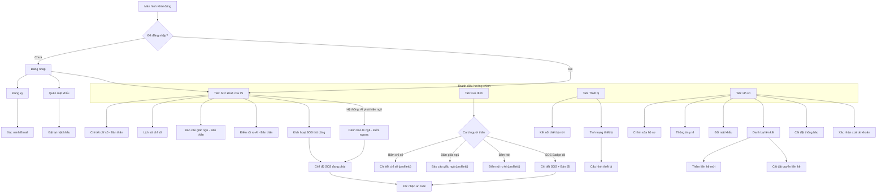

# 📱 Screen Index — HealthGuard Mobile

> Last updated: 2026-03-17
> Total screens: **41** | Spec files: **41/41** ✅ | Regenerated: **41/41** (template v3.0) | Built (health_system): **~22**
> **Build order:** Xem [BUILD_PHASES/README.md](../BUILD_PHASES/README.md) — 7 phase theo dependency
> **Tiến độ thực tế:** Xem [PROGRESS_REPORT.md](../PROGRESS_REPORT.md) — so sánh health_system vs spec

---

## Phase Build Order (Quick Reference)

| Phase | Tên | Screens | Spec | Built |
| --- | --- | --- | :---: | :---: |
| 1 | Shell & Auth | Splash, Login, Register, VerifyEmail, ForgotPassword, ResetPassword, Bottom Nav | ✅ 7/7 | ✅ 6/7 |
| 2 | Device + Dashboard | DEVICE_List, Connect, StatusDetail, HOME_Dashboard | ✅ 4/4 | ✅ 2/4 |
| 3 | Health Core | VitalDetail, HealthHistory, SLEEP_Report, SleepDetail, RiskReport, RiskReportDetail | ✅ 6/6 | ✅ 4/6 |
| 4 | Emergency SOS | ManualSOS, LocalSOSActive, FallAlert, IncomingSOSAlarm, SOSReceivedList, SOSReceivedDetail | ✅ 6/6 | ✅ 2/6 |
| 5 | Family | ContactList, AddContact, LinkedContactDetail, FamilyDashboard | ✅ 4/4 | ✅ 4/4 |
| 6 | Profile | Overview, EditProfile, MedicalInfo, ChangePassword, DeleteAccount | ✅ 5/5 | ✅ 4/5 |
| 7 | Notifications & Config | 10 screens | ✅ 10/10 | ⬜ 0/10 |

---

## 👥 Kiến trúc Người dùng (Hybrid Architecture — v3.0)

Ứng dụng HealthGuard Mobile sử dụng kiến trúc **Hybrid** — kết hợp giữa "Xem sức khoẻ bản thân" và "Giám sát người thân" thông qua **hai Tab riêng biệt** (thay vì Profile Switcher toàn cục như cũ):

- **Một Role duy nhất**: Mọi tài khoản đều có Role là `user`. Không phân chia cứng nhắc "Bệnh nhân" (Patient) hay "Người chăm sóc" (Caregiver).
- **Tab "Sức khoẻ của tôi"** (`HOME_Dashboard`): Luôn hiển thị dữ liệu của **chính bản thân** người dùng. Đơn giản, rõ ràng cho người già.
- **Tab "Gia đình"** (`HOME_FamilyDashboard`): Hiển thị **bird's-eye view** tất cả người thân được liên kết có quyền `can_view_vitals = true`. Polling 30 giây. SOS badge real-time qua FCM.
- **Drill-down theo profileId**: Khi bấm vào card người thân, `profileId` được truyền qua Route argument sang màn hình `VitalDetail`, `SleepReport`, v.v. Không có khái niệm "Context đang chọn" toàn cục.
- **~~Profile Switcher~~** *(Deprecated)*: Cơ chế cũ dùng `TargetProfileId` toàn cục đã bị loại bỏ. Thay thế bởi Hybrid Tab Architecture.

### Ma trận Quyền truy cập màn hình theo Tab

| Màn hình | Tab "Sức khoẻ của tôi" | Tab "Gia đình" (theo profileId) | Ghi chú |
| --- | :---: | :---: | --- |
| Login / Register / Forgot Password | ✅ | ❌ | Luồng Auth độc lập |
| **Dashboard (Sức khoẻ của tôi)** | ✅ | ❌ | Self-only, live vitals WebSocket |
| **Family Dashboard (Gia đình)** | ❌ | ✅ | Polling 30s, SOS badge FCM |
| Health Metrics / Vital Detail | ✅ (self) | ✅ (by profileId) | Cần `can_view_vitals` cho linked |
| Fall Alert Countdown | ✅ | ❌ | Chạy trên thiết bị người bị ngã |
| SOS Active (Emergency Mode) | ✅ | ❌ | Gửi SOS từ thiết bị bản thân |
| Manual SOS | ✅ | ❌ | Gửi SOS thủ công |
| SOS Received (Incoming Alarm) | ❌ | ✅ | FCM P0 full-screen, cần `can_receive_alerts` |
| SOS Detail + Map (War Room) | ❌ | ✅ | Cần `can_view_location` |
| Sleep Report | ✅ (self) | ✅ (by profileId) | Cần `can_view_vitals` cho linked |
| Risk Report / XAI | ✅ (self) | ✅ (by profileId) | Cần `can_view_vitals` cho linked |
| Device Management | ✅ | ❌ | Quản lý thiết bị bản thân |
| Profile / Settings | ✅ | ❌ | Cài đặt tài khoản cá nhân |
| Linked Contacts (Danh bạ) | ✅ | ❌ | Quản lý quyền chia sẻ ra ngoài |

---

## 🗺️ Navigation Overview (Hybrid Architecture — v3.0)



---

## 📋 Danh sách Màn hình theo Module

### 🔐 AUTH Module (UC001–UC005, UC009)

| #   | Screen Name     | File                     | Phase | UC Ref | Ngữ cảnh | Status    | Linked Screens                            |
| --- | --------------- | ------------------------ | :---: | ------ | -------- | --------- | ----------------------------------------- |
| 1   | Splash Screen   | `AUTH_Splash.md`         | 1     | —      | General  | ✅ Spec+Code | → Login, → Dashboard                      |
| 2   | Login           | `AUTH_Login.md`          | 1     | UC001  | General  | ✅ Spec+Code | → Register, → ForgotPassword, → Dashboard |
| 3   | Register        | `AUTH_Register.md`       | 1     | UC002  | General  | ✅ Spec+Code | → VerifyEmail, → Login                    |
| 4   | Verify Email    | `AUTH_VerifyEmail.md`    | 1     | UC002  | General  | ✅ Spec+Code | → Login                                   |
| 5   | Forgot Password | `AUTH_ForgotPassword.md` | 1     | UC003  | General  | ✅ Spec+Code | → Login, → ResetPassword                  |
| 6   | Reset Password  | `AUTH_ResetPassword.md`  | 1     | UC003  | General  | ✅ Spec+Code | → Login                                   |
| 7   | Onboarding      | `AUTH_Onboarding.md`     | 7     | —      | General  | ✅ Done | → Login, → Register                       |

---

### 🏠 HOME Module (Navigation Shell)

| #   | Screen Name | File | Phase | UC Ref | Ngữ cảnh | Status | Linked Screens |
| --- | --- | --- | :---: | --- | --- | --- | --- |
| 8   | Tab: Sức khoẻ của tôi | `HOME_Dashboard.md` | 2 | UC006, UC007, UC016, UC020 | Self | ✅ Done | → VitalDetail, → SleepReport, → RiskReport, → ManualSOS |
| 8a  | Tab: Gia đình | `HOME_FamilyDashboard.md` | 5 | UC006, UC015, UC030 | Linked | ✅ Done | → VitalDetail(profileId), → SleepReport(profileId), → RiskReport(profileId), → SOSReceivedDetail |

> **Kiến trúc Hybrid (v3.0)**: Không còn dùng Profile Switcher toàn cục. `HOME_Dashboard` luôn là Self-only. `HOME_FamilyDashboard` là bird's-eye view người thân liên kết.

---

### 📊 MONITORING Module (UC006–UC008)

| #   | Screen Name             | File                          | Phase | UC Ref | Ngữ cảnh | Status    | Linked Screens                 |
| --- | ----------------------- | ----------------------------- | :---: | ------ | -------- | --------- | ------------------------------ |
| 9   | Vital Sign Detail       | `MONITORING_VitalDetail.md`   | 3     | UC007  | Contextual| ✅ Done    | ← Dashboard/Family, → HealthHistory |
| 10  | Health History          | `MONITORING_HealthHistory.md` | 3     | UC008  | Contextual| ✅ Done    | ← VitalDetail, → VitalDetail   |

---

### 🚨 EMERGENCY Module (UC010, UC011, UC014, UC015)

| #   | Screen Name                       | File                              | Phase | UC Ref       | Ngữ cảnh | Status    | Linked Screens                      |
| --- | --------------------------------- | --------------------------------- | :---: | ------------ | -------- | --------- | ----------------------------------- |
| 12  | Fall Alert Countdown              | `EMERGENCY_FallAlert.md`          | 4     | UC010        | Self     | ✅ Done    | → LocalSOSActive                    |
| 12a | Manual SOS Trigger                | `EMERGENCY_ManualSOS.md`         | 4     | UC011, UC014 | Self     | ✅ Done    | → LocalSOSActive                    |
| 13  | SOS Active (Emergency Mode)       | `EMERGENCY_LocalSOSActive.md`     | 4     | UC011, UC014 | Self     | ✅ Done    | → Home (Resolved)                   |
| 14  | Incoming SOS Alarm                | `EMERGENCY_IncomingSOSAlarm.md`   | 4     | UC015        | Linked   | ✅ Done    | → SOSReceivedDetail                 |
| 15  | SOS Received List                 | `EMERGENCY_SOSReceivedList.md`    | 4     | UC015        | Linked   | ✅ Done    | → SOSReceivedDetail                 |
| 16  | SOS Detail + Map (War Room)       | `EMERGENCY_SOSReceivedDetail.md`  | 4     | UC011, UC015 | Linked   | ✅ Done    | → Home (Resolved)                   |

---

### 🔔 NOTIFICATION Module (UC030, UC031)

| #   | Screen Name                | File                                | Phase | UC Ref | Ngữ cảnh | Status    | Linked Screens                              |
| --- | -------------------------- | ----------------------------------- | :---: | ------ | -------- | --------- | ------------------------------------------- |
| 20  | Notification Center        | `NOTIFICATION_Center.md`            | 7     | UC031  | Contextual| ✅ Done | → Detail, → Settings, deep-link SOS/Sleep/Risk |
| 21  | Notification Detail        | `NOTIFICATION_Detail.md`            | 7     | UC031  | Contextual| ✅ Done | → SOSReceivedDetail, SLEEP_Report, ANALYSIS_RiskReport |
| 22  | Notification Settings      | `NOTIFICATION_Settings.md`          | 7     | UC031  | Self     | ✅ Done | ← Profile, Center; → EmergencyContacts |
| 23  | Emergency Contacts List    | `NOTIFICATION_EmergencyContacts.md` | 7     | UC030  | Self     | ✅ Done | → AddEditContact, PROFILE_ContactList |
| 24  | Add/Edit Emergency Contact | `NOTIFICATION_AddEditContact.md`    | 7     | UC030  | Self     | ✅ Done | ← EmergencyContacts                         |

---

### 📈 ANALYSIS Module (UC016, UC017)

| #   | Screen Name              | File                           | Phase | UC Ref | Ngữ cảnh | Status    | Linked Screens                      |
| --- | ------------------------ | ------------------------------ | :---: | ------ | -------- | --------- | ----------------------------------- |
| 25  | Risk Report Overview     | `ANALYSIS_RiskReport.md`       | 3     | UC016  | Contextual| ✅ Done | → RiskReportDetail, → RiskHistory |
| 26  | Risk Report Detail (XAI) | `ANALYSIS_RiskReportDetail.md` | 3     | UC017  | Contextual| ✅ Done | ← RiskReport, → VitalDetail        |
| 27  | Risk History             | `ANALYSIS_RiskHistory.md`      | 7     | UC016  | Contextual| ✅ Done | ← RiskReport, → RiskReportDetail  |

---

### 😴 SLEEP Module (UC020, UC021)

| #   | Screen Name                 | File                        | Phase | UC Ref | Ngữ cảnh | Status    | Linked Screens                |
| --- | --------------------------- | --------------------------- | :---: | ------ | -------- | --------- | ----------------------------- |
| 28  | Sleep Report (Latest Night) | `SLEEP_Report.md`           | 3     | UC021  | Contextual| ✅ Done | → SleepDetail, → SleepHistory, → TrackingSettings |
| 29  | Sleep Detail (Timeline)     | `SLEEP_Detail.md`           | 3     | UC021  | Contextual| ✅ Done | ← SleepReport                 |
| 30  | Sleep History (Trend)       | `SLEEP_History.md`          | 7     | UC021  | Contextual| ✅ Done | ← SleepReport, → SleepReport  |
| 31  | Sleep Tracking Settings     | `SLEEP_TrackingSettings.md` | 7     | UC020  | Self     | ✅ Done | ← SleepReport, Profile        |

---

### 📱 DEVICE Module (UC040–UC042)

| #   | Screen Name          | File                     | Phase | UC Ref | Ngữ cảnh | Status    | Linked Screens                  |
| --- | -------------------- | ------------------------ | :---: | ------ | -------- | --------- | ------------------------------- |
| 32  | Device List          | `DEVICE_List.md`         | 2     | UC042  | Self     | ✅ Done | → StatusDetail, → Connect |
| 33  | Device Status Detail | `DEVICE_StatusDetail.md` | 2     | UC042  | Self     | ✅ Done | ← DeviceList, → Configure  |
| 34  | Connect New Device   | `DEVICE_Connect.md`      | 2     | UC040  | Self     | ✅ Done | ← DeviceList               |
| 35  | Configure Device     | `DEVICE_Configure.md`    | 7     | UC041  | Self     | ✅ Done | ← StatusDetail, → DeviceList |

---

### 👤 PROFILE Module (UC005, UC009)

| #   | Screen Name                 | File                        | Phase | UC Ref | Ngữ cảnh | Status    | Linked Screens                              |
| --- | --------------------------- | --------------------------- | :---: | ------ | -------- | --------- | ------------------------------------------- |
| 36  | Profile Overview            | `PROFILE_Overview.md`       | 6     | UC005  | Self     | ✅ Done    | → EditProfile, → ChangePassword, → Settings |
| 37  | Edit Profile                | `PROFILE_EditProfile.md`    | 6     | UC005  | Self     | ✅ Done    | ← ProfileOverview                           |
| 38  | Medical Info                | `PROFILE_MedicalInfo.md`    | 6     | UC005  | Contextual| ✅ Done | ← ProfileOverview                           |
| 39  | Change Password             | `PROFILE_ChangePassword.md` | 6     | UC004  | Self     | ✅ Done | ← ProfileOverview                           |
| 40  | Delete Account Confirm      | `PROFILE_DeleteAccount.md`  | 6     | UC005  | Self     | ✅ Done | ← ProfileOverview, → Login                 |
| 41  | Danh bạ Liên kết (Contacts) | `PROFILE_ContactList.md`    | 5     | UC005  | Contextual| ✅ Done | → AddContact, → LinkedContactDetail         |
| 42  | Thêm Liên hệ mới            | `PROFILE_AddContact.md`     | 5     | UC005  | Contextual| ✅ Done | ← ContactList                               |
| 43  | Cài đặt Chi tiết Liên hệ    | `PROFILE_LinkedContactDetail.md`| 5  | UC005, UC015| Contextual| ✅ Done | ← ContactList                       |

### ~~🔁 PROFILE CHANGER~~ *(Deprecated — Đã thay thế bởi Hybrid Architecture)*
| #   | Screen Name | File | UC Ref | Ngữ cảnh | Status | Ghi chú |
| --- | --- | --- | --- | --- | --- | --- |
| ~~44~~ | ~~Profile Switcher Dropdown~~ | ~~Component (Chung)~~ | ~~UC006~~ | ~~Global~~ | ❌ Deprecated | Thay bởi `HOME_FamilyDashboard` Tab. Không cần implement. |

---

## 🔍 Phân tích chuyên sâu — Hybrid Architecture (v3.0)

Kiến trúc Hybrid giải quyết vấn đề cốt lõi của Profile Switcher cũ: **người già bị rối khi phải "chọn đang xem ai"** trước khi làm bất cứ thứ gì.

### Tại sao Hybrid thay Profile Switcher?

| Tiêu chí | Profile Switcher (cũ) | Hybrid Tabs (mới) |
| --- | --- | --- |
| Mental model | Phức tạp — phải nhớ "đang xem ai" | Rõ ràng — Tab nào = nội dung đó |
| Người già | Dễ nhầm lẫn, xem nhầm dữ liệu | Tab "Của tôi" luôn là của mình |
| Người chăm sóc | Phải switch qua lại liên tục | Tab "Gia đình" = tổng quan mọi người |
| SOS Alert | Có thể bỏ sót nếu đang xem Self | Badge + FCM P0 luôn nổi bật |
| Kỹ thuật | Global state `TargetProfileId` phức tạp | Route argument `profileId` đơn giản |

### Nguyên tắc thiết kế cốt lõi

1. **Tab "Sức khoẻ của tôi"** = Luôn là bản thân. Không context switching.
2. **Tab "Gia đình"** = Tổng quan tất cả người thân có quyền xem. Bấm vào chỉ số, giấc ngủ, hoặc risk summary của ai → xem chi tiết của người đó.
3. **Drill-down qua Route argument** `profileId`: Màn hình `VitalDetail`, `SleepReport`, `RiskReport` nhận `profileId` qua parameter. Nếu không có `profileId` → mặc định là bản thân.
4. **SOS luôn ưu tiên tuyệt đối**: FCM `IncomingSOSAlarm` có Z-Index P0 đè lên mọi màn hình, bất kể user đang ở tab nào.

### Accessibility (Trải nghiệm người già)
- Font size ≥ 16sp (body), ≥ 14sp (caption).
- Touch target ≥ 48dp × 48dp.
- Nút SOS to rõ, slide-to-cancel thay vì tap để tránh nhầm.
- Text Scaling 150-200%: Layout responsive, không dùng fixed aspect ratio.

---

## 📋 TASK Report

```
📋 TASK Report (2026-03-17) — Post-Regenerate Sync:
- Total screens: 41
- Spec files: 41/41 ✅ (all regenerated per screen_spec_template v3.0)
- Cross-link validation: ✅ No broken links (all `./MODULE_Screen.md` links resolve to existing files)
- Orphan screens: 0
- Missing screens: 0
- One-way links: Some (acceptable — e.g. HOME_Dashboard → many; back via Back button)
- README.md updated: ✅

Sync Summary:
  - MONITORING_HealthMetrics removed from index (file never existed; VitalDetail + HealthHistory are the actual screens)
  - All 41 screens marked ✅ Done (regenerated with UI States, Edge Cases, Data Requirements, Sync Notes, Design Context, Pipeline Status, Changelog)
  - Architecture: Hybrid Tabs (v3.0) — unchanged
```

---

## Changelog

| Version | Date       | Author                      | Changes                                                                                                |
| ------- | ---------- | --------------------------- | ------------------------------------------------------------------------------------------------------ |
| v1.0    | 2026-03-10 | AI (mobile-agent TASK scan) | Initial creation — 42 screens discovered from 22 UCs + SRS, role-based analysis (Patient vs Caregiver) |
| v2.0    | 2026-03-14 | AI (System Auditor)         | Refactored to Universal User & Linked Profile Context. Removed Role-based Screen separation. |
| v3.0    | 2026-03-16 | AI (Architecture Review)    | Hybrid Architecture: Profile Switcher deprecated. Tách HOME_Dashboard (self) + HOME_FamilyDashboard (family). Cập nhật Navigation diagram. |
| v3.1    | 2026-03-16 | AI (Phase Build)            | Thêm Phase build order (7 phases), cột Phase vào tất cả bảng. Link BUILD_PHASES/README.md. |
| v3.2    | 2026-03-17 | AI (TASK verify)            | Tạo 6 AUTH spec files từ health_system. Thêm PROGRESS_REPORT.md. |
| v3.3    | 2026-03-17 | AI (Phase 2–7 review)      | Tạo đầy đủ spec cho Phase 2–7: DEVICE (3), MONITORING (2), SLEEP (4), ANALYSIS (3), EMERGENCY (6), PROFILE (5), NOTIFICATION (5), AUTH_Onboarding. Tổng 41 spec files. Cập nhật acceptance gates. |
| v3.4    | 2026-03-17 | AI (TASK sync)            | Regenerate 41/41 screens theo template v3.0. Cross-link validation: 0 broken. README cập nhật status Done cho tất cả. Xóa MONITORING_HealthMetrics (không tồn tại). |
| v3.5    | 2026-03-17 | AI (TASK sync)            | Sync validation: 0 broken links, 0 orphans, 0 missing. Fixed TASK Report placeholder text. |
| v3.6    | 2026-03-17 | AI (Cross-check sync)    | Đồng bộ Risk flow theo Hybrid Architecture: FamilyDashboard có drill-down sang `RiskReport(profileId)`; giữ nguyên nguyên tắc không dùng Profile Switcher. |
