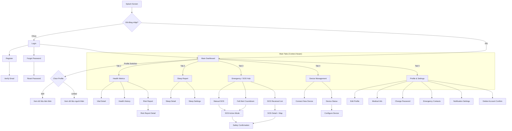

# 📱 Screen Index — HealthGuard Mobile

> Last updated: 2026-03-14
> Total screens discovered: **41** | Spec files exist: **0/41** | Built/Implemented: **15/41** | Missing: **26/41**

---

## 👥 Kiến trúc Người dùng (Universal User & Linked Profiles)

Ứng dụng HealthGuard Mobile sử dụng kiến trúc **Universal User**, quản lý truy cập thông qua **Profile Switcher** (Dữ liệu liên kết Profile):

- **Một Role duy nhất**: Mọi tài khoản đều có Role là `user`. Không còn phân chia cứng nhắc "Bệnh nhân" (Patient) hay "Người chăm sóc" (Caregiver).
- **Profile Switcher**: Người dùng đăng nhập có thể xem dữ liệu và nhận thông báo của **chính mình** (Self Profile) và **người thân** (Linked Profiles) dựa trên quyền hạn được cấp trong bảng `user_relationships`.
- **TargetProfileId Context**: Giao diện ứng dụng tự động thay đổi dựa vào Profile đang được chọn ở Navbar (Context hiển thị của "Bố", "Mẹ", hoặc "Bản thân").

### Ma trận Quyền truy cập màn hình theo Ngữ cảnh Profile

| Màn hình                           | Self Profile (Bản thân) | Linked Profile (Người thân) | Ghi chú                                  |
| ---------------------------------- | :---------------------: | :-------------------------: | ---------------------------------------- |
| Login / Register / Forgot Password |           ✅            |             ❌              | Luồng Auth độc lập cho mỗi tài khoản     |
| **Dashboard** (Chung)              |           ✅            |             ✅              | Tự động hiển thị dữ liệu của Profile được chọn |
| Health Metrics (Vitals)            |           ✅            |             ✅              | Dựa trên quyền `can_view_vitals`         |
| Health Metrics Detail              |           ✅            |             ✅              | Drill-down 1 chỉ số                      |
| Health History                     |           ✅            |             ✅              | Xu hướng dài hạn                         |
| Fall Alert Countdown               |           ✅            |             ❌              | Chạy trên thiết bị của Profile bị ngã    |
| SOS Active (Emergency Mode)        |           ✅            |             ❌              | Profile đang trong chế độ khẩn cấp       |
| Manual SOS                         |           ✅            |             ❌              | Gửi SOS thủ công từ máy Profile          |
| SOS Received (xuyên Profile)       |           ❌            |             ✅              | Nhận SOS nếu có `can_receive_alerts`     |
| SOS Detail + Map                   |           ❌            |             ✅              | Xem vị trí người thân đang cấp cứu       |
| Safety Confirmation                |           ✅            |             ✅              | Cả 2 phía đều có thể xác nhận an toàn    |
| Risk Report                        |           ✅            |             ✅              | Xem điểm rủi ro AI                       |
| Risk Report Detail                 |           ✅            |             ✅              | XAI giải thích                           |
| Sleep Report                       |           ✅            |             ✅              | Cũng dựa trên quyền `can_view_vitals`    |
| Device Management                  |           ✅            |             ❌              | Quản lý thiết bị của Profile đang chọn   |
| Configure Emergency Contacts       |           ✅            |             ❌              | Quản lý SĐT khẩn cấp của Profile         |
| Notifications Center               |           ✅            |             ✅              | Gộp thông báo từ các Profile có quyền xem|
| Profile / Settings                 |           ✅            |             ❌              | Cài đặt tài khoản Root User              |

---

## 🗺️ Navigation Overview (Profile-Driven)



---

## 📋 Danh sách Màn hình theo Module

### 🔐 AUTH Module (UC001–UC005, UC009)

| #   | Screen Name     | File                     | UC Ref | Ngữ cảnh | Status    | Linked Screens                            |
| --- | --------------- | ------------------------ | ------ | -------- | --------- | ----------------------------------------- |
| 1   | Splash Screen   | `AUTH_Splash.md`         | —      | General  | ✅ Done    | → Login, → Dashboard                      |
| 2   | Login           | `AUTH_Login.md`          | UC001  | General  | ✅ Done    | → Register, → ForgotPassword, → Dashboard |
| 3   | Register        | `AUTH_Register.md`       | UC002  | General  | ✅ Done    | → VerifyEmail, → Login                    |
| 4   | Verify Email    | `AUTH_VerifyEmail.md`    | UC002  | General  | ✅ Done    | → Login                                   |
| 5   | Forgot Password | `AUTH_ForgotPassword.md` | UC003  | General  | ✅ Done    | → Login, → ResetPassword                  |
| 6   | Reset Password  | `AUTH_ResetPassword.md`  | UC003  | General  | ✅ Done    | → Login                                   |
| 7   | Onboarding      | `AUTH_Onboarding.md`     | —      | General  | ⬜ Missing | → Login, → Register                       |

---

### 🏠 HOME Module (Navigation Shell)

| #   | Screen Name         | File                         | UC Ref | Ngữ cảnh | Status    | Linked Screens                               |
| --- | ------------------- | ---------------------------- | ------ | -------- | --------- | -------------------------------------------- |
| 8   | Main Dashboard      | `HOME_Dashboard.md`          | UC006  | Contextual| ✅ Done    | → HealthMetrics, → RiskReport, → SleepReport |

*(Lưu ý: Dashboard giờ đây là 1 cấu trúc hợp nhất và nội dung thay đổi linh hoạt theo Profile đang chọn).*

---

### 📊 MONITORING Module (UC006–UC008)

| #   | Screen Name             | File                          | UC Ref | Ngữ cảnh | Status    | Linked Screens                 |
| --- | ----------------------- | ----------------------------- | ------ | -------- | --------- | ------------------------------ |
| 9   | Health Metrics Overview | `MONITORING_HealthMetrics.md` | UC006  | Contextual| ✅ Done    | → VitalDetail, → HealthHistory |
| 10  | Vital Sign Detail       | `MONITORING_VitalDetail.md`   | UC007  | Contextual| ⬜ Missing | ← HealthMetrics, → ExportData  |
| 11  | Health History          | `MONITORING_HealthHistory.md` | UC008  | Contextual| ⬜ Missing | ← HealthMetrics, → VitalDetail |

---

### 🚨 EMERGENCY Module (UC010, UC011, UC014, UC015)

| #   | Screen Name                       | File                              | UC Ref       | Ngữ cảnh | Status    | Linked Screens                      |
| --- | --------------------------------- | --------------------------------- | ------------ | -------- | --------- | ----------------------------------- |
| 12  | Fall Alert Countdown              | `EMERGENCY_FallAlert.md`          | UC010        | Self     | ⬜ Missing | → SOSActive, → SafetyConfirm        |
| 13  | Fall Alert — False Alarm Feedback | `EMERGENCY_FalseAlarmFeedback.md` | UC010        | Self     | ⬜ Missing | ← FallAlert                         |
| 14  | Manual SOS Trigger                | `EMERGENCY_ManualSOS.md`          | UC014        | Self     | ⬜ Missing | → SOSActive                         |
| 15  | SOS Active (Emergency Mode)       | `EMERGENCY_SOSActive.md`          | UC014, UC010 | Self     | ⬜ Missing | → SafetyConfirm                     |
| 16  | SOS Confirm Popup                 | `EMERGENCY_SOSConfirm.md`         | UC014        | Self     | ⬜ Missing | → SOSActive                         |
| 17  | Safety Confirmation               | `EMERGENCY_SafetyConfirm.md`      | UC011        | Contextual| ⬜ Missing | ← SOSActive, ← SOSDetail            |
| 18  | SOS Received List                 | `EMERGENCY_SOSReceivedList.md`    | UC015        | Linked   | ✅ Done    | → SOSDetail                         |
| 19  | SOS Detail + Map                  | `EMERGENCY_SOSDetail.md`          | UC015        | Linked   | ✅ Done    | → SafetyConfirm, → Call, → Navigate |

---

### 🔔 NOTIFICATION Module (UC030, UC031)

| #   | Screen Name                | File                                | UC Ref | Ngữ cảnh | Status    | Linked Screens                              |
| --- | -------------------------- | ----------------------------------- | ------ | -------- | --------- | ------------------------------------------- |
| 20  | Notification Center        | `NOTIFICATION_Center.md`            | UC031  | Contextual| ⬜ Missing | → NotifDetail, → HealthMetrics, → SOSDetail |
| 21  | Notification Detail        | `NOTIFICATION_Detail.md`            | UC031  | Contextual| ⬜ Missing | → Linked screen based on type               |
| 22  | Notification Settings      | `NOTIFICATION_Settings.md`          | UC031  | Self     | ⬜ Missing | ← Profile                                   |
| 23  | Emergency Contacts List    | `NOTIFICATION_EmergencyContacts.md` | UC030  | Self     | ⬜ Missing | → AddEditContact                            |
| 24  | Add/Edit Emergency Contact | `NOTIFICATION_AddEditContact.md`    | UC030  | Self     | ⬜ Missing | ← EmergencyContacts                         |

---

### 📈 ANALYSIS Module (UC016, UC017)

| #   | Screen Name              | File                           | UC Ref | Ngữ cảnh | Status    | Linked Screens                      |
| --- | ------------------------ | ------------------------------ | ------ | -------- | --------- | ----------------------------------- |
| 25  | Risk Report Overview     | `ANALYSIS_RiskReport.md`       | UC016  | Contextual| ⬜ Missing | → RiskReportDetail, → HealthMetrics |
| 26  | Risk Report Detail (XAI) | `ANALYSIS_RiskReportDetail.md` | UC017  | Contextual| ⬜ Missing | ← RiskReport                        |
| 27  | Risk History             | `ANALYSIS_RiskHistory.md`      | UC016  | Contextual| ⬜ Missing | ← RiskReport, → RiskReportDetail    |

---

### 😴 SLEEP Module (UC020, UC021)

| #   | Screen Name                 | File                        | UC Ref | Ngữ cảnh | Status    | Linked Screens                |
| --- | --------------------------- | --------------------------- | ------ | -------- | --------- | ----------------------------- |
| 28  | Sleep Report (Latest Night) | `SLEEP_Report.md`           | UC021  | Contextual| ✅ Done    | → SleepDetail, → SleepHistory |
| 29  | Sleep Detail (Timeline)     | `SLEEP_Detail.md`           | UC021  | Contextual| ⬜ Missing | ← SleepReport                 |
| 30  | Sleep History (Trend)       | `SLEEP_History.md`          | UC021  | Contextual| ⬜ Missing | ← SleepReport, → SleepDetail  |
| 31  | Sleep Tracking Settings     | `SLEEP_TrackingSettings.md` | UC020  | Self     | ⬜ Missing | ← Profile                     |

---

### 📱 DEVICE Module (UC040–UC042)

| #   | Screen Name          | File                     | UC Ref | Ngữ cảnh | Status    | Linked Screens                  |
| --- | -------------------- | ------------------------ | ------ | -------- | --------- | ------------------------------- |
| 32  | Device List          | `DEVICE_List.md`         | UC042  | Self     | ✅ Done    | → DeviceDetail, → ConnectDevice |
| 33  | Device Status Detail | `DEVICE_StatusDetail.md` | UC042  | Self     | ⬜ Missing | ← DeviceList, → ConfigureDevice |
| 34  | Connect New Device   | `DEVICE_Connect.md`      | UC040  | Self     | ⬜ Missing | ← DeviceList                    |
| 35  | Configure Device     | `DEVICE_Configure.md`    | UC041  | Self     | ⬜ Missing | ← DeviceDetail                  |

---

### 👤 PROFILE Module (UC005, UC009)

| #   | Screen Name                 | File                        | UC Ref | Ngữ cảnh | Status    | Linked Screens                              |
| --- | --------------------------- | --------------------------- | ------ | -------- | --------- | ------------------------------------------- |
| 36  | Profile Overview            | `PROFILE_Overview.md`       | UC005  | Self     | ✅ Done    | → EditProfile, → ChangePassword, → Settings |
| 37  | Edit Profile                | `PROFILE_EditProfile.md`    | UC005  | Self     | ✅ Done    | ← ProfileOverview                           |
| 38  | Medical Info                | `PROFILE_MedicalInfo.md`    | UC005  | Contextual| ⬜ Missing | ← ProfileOverview                           |
| 39  | Change Password             | `PROFILE_ChangePassword.md` | UC004  | Self     | ✅ Done    | ← ProfileOverview                           |
| 40  | Delete Account Confirm      | `PROFILE_DeleteAccount.md`  | UC005  | Self     | ⬜ Missing | ← ProfileOverview                           |

### 🔁 PROFILE CHANGER (Tính năng chìm ở Header Mọi màn hình)
| #   | Screen Name                 | File                        | UC Ref | Ngữ cảnh | Status    | Linked Screens                              |
| --- | --------------------------- | --------------------------- | ------ | -------- | --------- | ------------------------------------------- |
| 41  | Profile Switcher Dropdown   | Component (Chung)           | UC006  | Global   | ⬜ Missing | Switch Ngữ cảnh Dashboard và toàn bộ App    |

---

## 🔍 Phân tích chuyên sâu The New "Netflix-style" Flow

Thay vì phân nhánh ra các màn riêng biệt cho Patient và Caregiver, Mobile App hoạt động dựa trên State toàn cục `TargetProfileId`.

1. **Header Navigation:** Có chứa một **Profile Switcher** (như tính năng đổi Profile của Netflix). Nạp dữ liệu từ endpoint `GET /api/mobile/access-profiles`.
2. **Dynamic Context (Ngữ Cảnh Linh Hoạt):**
   - Chọn *Hồ sơ Bản thân*: Hiển thị chỉ số bản thân, quyền cấu hình thiết bị, cảnh báo báo động cấp cứu thiết bị của mình.
   - Chọn *Hồ sơ Bố mẹ (Linked)*: Hiển thị chỉ số của Bố mẹ nhưng các tab như Thiết bị, Cài đặt mật khẩu sẽ bị ẩn hoặc vô hiệu hóa. Đồng thời hiển thị SOS List của người đang theo dõi.
3. **Accessibility (Trải nghiệm người già):**
   - Font size ≥ 16sp (body), ≥ 14sp (caption).
   - Touch target ≥ 48dp × 48dp.
   - Nút SOS to rõ, thao tác thiết kế an toàn tránh chạm gõ nhầm.
   - Network Interceptor Middleware nằm chìm trong ứng dụng, tự kẹp Headers `TargetProfileId` vào mọi request sức khỏe.

---

## 📋 TASK Report

```
📋 TASK Report (2026-03-14):
- Total screens discovered from SRS/UC: 41
- Architecture: Unified Profile Context (1 App, multiple views)
- Built/Implemented: 15 screens
- Missing: 26 screens
- Newly created this run: 0 (awaiting confirmation)
- README.md updated: ✅

🔑 Key Insight:
  - Khai tử Patient/Caregiver Dashboard. Cả 2 được sáp nhập thành `HOME_Dashboard.md` Dynamic Context.
  - Sử dụng Profile Switcher trên Header như trái tim điều hướng ngữ cảnh của ứng dụng.
```

---

## Changelog

| Version | Date       | Author                      | Changes                                                                                                |
| ------- | ---------- | --------------------------- | ------------------------------------------------------------------------------------------------------ |
| v1.0    | 2026-03-10 | AI (mobile-agent TASK scan) | Initial creation — 42 screens discovered from 22 UCs + SRS, role-based analysis (Patient vs Caregiver) |
| v2.0    | 2026-03-14 | AI (System Auditor)         | Refactored to Universal User & Linked Profile Context. Removed Role-based Screen separation.            |
