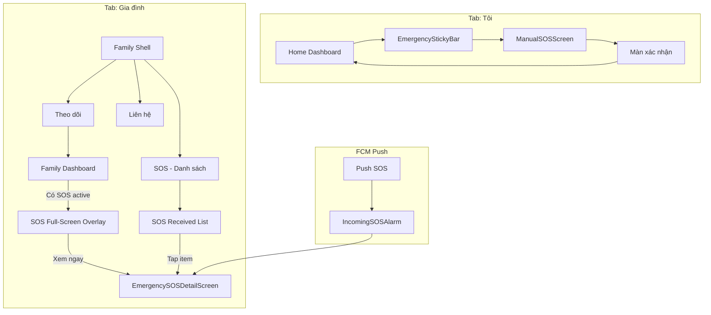

# EMERGENCY SOS — Luồng Hoạt Động & Build Plan

> **Mục tiêu**: Định nghĩa luồng SOS hợp lý nhất từ góc nhìn đa người dùng, qua multi-agent review, và đề xuất thứ tự implement.  
> **Scope**: Gửi SOS (Patient), Nhận/Xem SOS (Caregiver), Lối vào danh sách SOS.  
> **Methodology**: Multi-Agent Brainstorming (Skeptic → Constraint Guardian → User Advocate → Integrator).

---

## 📋 Sub-Plans (Dùng Cho Agent)

| Plan | File | Nội dung | Khi nào dùng |
|------|------|----------|--------------|
| **01** | [EMERGENCY_SOS_01_Navigation_Flow_Plan.md](./EMERGENCY_SOS_01_Navigation_Flow_Plan.md) | Luồng màn hình, route, link giữa các màn | Implement navigation, routing |
| **02** | [EMERGENCY_SOS_02_FE_Architecture_Plan.md](./EMERGENCY_SOS_02_FE_Architecture_Plan.md) | UI/UX, mock data, sync style (AppColors, AppTextStyles) | Implement UI, styling |
| **03** | [EMERGENCY_SOS_03_Folder_Architecture_Plan.md](./EMERGENCY_SOS_03_Folder_Architecture_Plan.md) | Cấu trúc thư mục, import path, file mới/sửa | Tạo/sửa file đúng vị trí |

**Agent instruction**: Đọc Plan 01 trước (navigation), Plan 03 (folder) khi tạo file, Plan 02 (UI) khi implement từng màn.

---

## 1. Tổng Quan Luồng Đề Xuất

### 1.1. Luồng Gửi SOS (Patient / Self)

```
Tab "Tôi" (Home Dashboard)
    └─ EmergencyStickyBar "Gọi SOS khẩn cấp"
        └─ ManualSOSScreen
            ├─ Countdown 5s (hoặc trượt "GỬI NGAY")
            ├─ Lấy GPS
            └─ POST /emergency/sos/trigger
                └─ SnackBar / Màn xác nhận → Quay Dashboard
```

### 1.2. Luồng Nhận SOS (Caregiver) — Push Notification

```
FCM Push "SOS từ [Tên]"
    └─ Deep link → IncomingSOSAlarm (full-screen)
        └─ "Xem chi tiết" → EmergencySOSDetailScreen (sosId)
            ├─ Map + vị trí
            ├─ Nút gọi điện
            └─ Nút mở bản đồ
```

### 1.3. Luồng Xem Danh Sách SOS (Caregiver) — Routine

```
Lối vào: Tab "Gia đình" → Sub-entry "Danh sách SOS"
    └─ EmergencySOSReceivedListScreen
        ├─ Filter: Tất cả / Đang active / Đã xử lý
        ├─ Search theo tên
        └─ Tap item → EmergencySOSDetailScreen
```

### 1.4. Luồng SOS Active Khi Vào Tab Gia Đình

```
Tab "Gia đình" → Family Dashboard
    └─ Nếu có SOS active
        └─ FamilySOSFullScreenOverlay
            └─ "Xem ngay" → EmergencySOSDetailScreen (sosId)
```

---

## 2. Multi-Agent Review

### 2.1. Skeptic / Challenger

| # | Objection | Risk |
|---|-----------|------|
| S1 | Countdown 5s có thể quá lâu khi thực sự khẩn cấp | User bỏ cuộc hoặc chờ lâu |
| S2 | SnackBar dễ bỏ qua — user không biết người thân đã nhận chưa | Anxiety, gọi lại nhiều lần |
| S3 | Danh sách SOS nằm trong Tab "Gia đình" — user có thể không tìm thấy | Caregiver bỏ sót lịch sử SOS |
| S4 | Family overlay "Xem ngay" hiện điều hướng tới PersonDetail (profileId) thay vì SOS Detail (sosId) | Sai spec, thiếu Map + thông tin SOS |
| S5 | Không có tab "Khẩn cấp" riêng — mọi thứ SOS gắn vào Gia đình hoặc Home | Có thể gây nhầm lẫn: "Gửi SOS" vs "Xem SOS nhận được" |

**Resolution (Primary Designer)**:
- S1: Giảm countdown xuống 3s; giữ nút "Trượt để GỬI NGAY" nổi bật.
- S2: Thay SnackBar bằng màn xác nhận ngắn: "Đã gửi SOS. X người thân đã được thông báo."
- S3: Thêm entry point rõ ràng trong Tab Gia đình — FAB hoặc section "SOS đã nhận" ở đầu list.
- S4: Sửa overlay → điều hướng tới EmergencySOSDetailScreen(sosId), không phải PersonDetail.
- S5: Không thêm tab Khẩn cấp — giữ 4 tab. SOS gửi = Tab Tôi; SOS nhận = Tab Gia đình. Đơn giản hóa.

---

### 2.2. Constraint Guardian

| # | Constraint | Assessment |
|---|------------|------------|
| C1 | Performance: ManualSOS phải gửi trong ≤5s (SRS) | OK — API trigger nhanh; GPS có timeout 5s |
| C2 | Security: SOS chỉ gửi đến user có can_receive_alerts | Backend xử lý — ngoài scope mobile |
| C3 | Reliability: Mất mạng khi gửi SOS | ManualSOS có retry/error state — cần verify |
| C4 | Maintainability: EmergencyMainScreen có 2 tab nhưng chưa route | Cần quyết định: dùng EmergencyMainScreen hay nhúng SOS List vào Family |

**Resolution**:
- C4: **Nhúng Danh sách SOS vào Tab Gia đình** — thêm sub-tab hoặc section "SOS đã nhận" có thể mở full-screen. Không cần EmergencyMainScreen riêng với 2 tab (SOS + Danh sách). Đơn giản hóa navigation.

---

### 2.3. User Advocate

| # | Concern | Persona |
|---|---------|---------|
| U1 | Ông 70 tuổi: Nút SOS có dễ thấy không? | ✅ EmergencyStickyBar luôn ở dưới, màu đỏ |
| U2 | Chị 45 tuổi: Làm sao xem "tất cả SOS đã nhận"? | ⚠️ Cần lối vào rõ — từ Tab Gia đình |
| U3 | Bà 65 tuổi (vừa self vừa caregiver): Tab Tôi vs Gia đình có rõ không? | ✅ Tab Tôi = mình; Gia đình = người thân. SOS gửi = Tôi; SOS nhận = Gia đình |
| U4 | Sau khi gửi SOS, user có yên tâm không? | ⚠️ Cần màn xác nhận rõ hơn SnackBar |
| U5 | Khi có SOS active, overlay có gây hoảng không? | ✅ Overlay rõ ràng, có nút đóng; CTA "Xem ngay" rõ |

**Resolution**:
- U2: Entry point "Danh sách SOS" trong Tab Gia đình — có thể là:
  - **Option A**: Header/FAB "SOS đã nhận" khi có badge
  - **Option B**: Sub-tab thứ 3 trong Family Shell: Theo dõi | Liên hệ | **SOS**
  - **Option C**: Section collapsible ở đầu Family Dashboard khi có SOS
- Đề xuất: **Option B** — thêm tab "SOS" trong Family Shell khi user có quyền can_receive_alerts. Nếu không có quyền thì không hiện tab.

---

## 3. Decision Log

| ID | Decision | Alternatives | Objections | Resolution |
|----|----------|--------------|------------|------------|
| D1 | Nút SOS chỉ ở Tab "Tôi" | Đặt ở mọi tab | — | SOS là hành động của bản thân; Tab Gia đình là xem người khác |
| D2 | Danh sách SOS nằm trong Tab "Gia đình" | Tab Khẩn cấp riêng | S3, S5 | Giữ 4 tab; thêm sub-tab "SOS" trong Family Shell |
| D3 | Countdown 3s (thay 5s) | 5s, 0s | S1 | 3s cân bằng giữa tránh nhầm và tốc độ |
| D4 | Màn xác nhận sau gửi SOS (không dùng SnackBar) | SnackBar | S2, U4 | Màn full-screen ngắn: "Đã gửi. X người thân đã được thông báo." |
| D5 | Family overlay "Xem ngay" → EmergencySOSDetailScreen(sosId) | PersonDetail(profileId) | S4 | Sửa để đúng spec SOS Detail + Map |
| D6 | Không dùng EmergencyMainScreen riêng | Giữ EmergencyMainScreen | C4 | Nhúng SOS List vào Family Shell tab "SOS" |

---

## 4. Luồng Hợp Lý Nhất (Final)

### 4.1. Kiến Trúc Điều Hướng

```
Bottom Nav: Tôi | Gia đình | Thiết bị | Hồ sơ

Tab "Tôi":
  - Home Dashboard
  - EmergencyStickyBar → ManualSOSScreen
  - (Sau gửi) → Màn xác nhận → Back Dashboard

Tab "Gia đình":
  - Family Shell: 3 sub-tab
    - Theo dõi (Family Dashboard)
    - Liên hệ (Contact List)
    - SOS (EmergencySOSReceivedListScreen)  ← MỚI
  - Family Dashboard có SOS active → Overlay → EmergencySOSDetailScreen(sosId)
  - Tab SOS: Filter, search, tap → EmergencySOSDetailScreen

FCM Push SOS:
  - Deep link → IncomingSOSAlarm → EmergencySOSDetailScreen
```

### 4.2. Điều Kiện Hiện Tab "SOS"

- Tab "SOS" trong Family Shell **chỉ hiện** khi:
  - User có ít nhất 1 relationship với `can_receive_alerts = true`
- Nếu không có → 2 tab như hiện tại: Theo dõi | Liên hệ

### 4.3. Sơ Đồ Luồng (Mermaid)



---

## 5. Build Plan — Thứ Tự Implement

### Phase 1: Wire Luồng Gửi SOS (P0)

| # | Task | File(s) | Mô tả |
|---|------|---------|-------|
| 1.1 | Gắn onPressed EmergencyStickyBar | `home_dashboard_screen.dart` | `Navigator.push` → ManualSOSScreen |
| 1.2 | Thêm route manual-sos | `app_router.dart` | Route `/manual-sos` → ManualSOSScreen |
| 1.3 | Giảm countdown 5s → 3s | `manual_sos_screen.dart` | `_countdown = 3` |
| 1.4 | Màn xác nhận thay SnackBar | `manual_sos_screen.dart` | Sau gửi thành công → push màn "Đã gửi. X người thân đã được thông báo." (mock X=1) |

### Phase 2: Sửa Family SOS Overlay (P0)

| # | Task | File(s) | Mô tả |
|---|------|---------|-------|
| 2.1 | Overlay "Xem ngay" → SOS Detail | `family_dashboard_screen.dart`, `family_sos_full_screen_overlay.dart` | Thay `PersonDetail(profileId)` bằng `EmergencySOSDetailScreen(sosId)` |
| 2.2 | Truyền sosId từ FamilyProfileSnapshot | `family_profile_snapshot.dart`, `family_dashboard_mock_provider.dart` | Thêm `sosId` khi `isSosActive` |
| 2.3 | Thêm route sos-detail | `app_router.dart` | Route `/emergency/sos/:id` → EmergencySOSDetailScreen |

### Phase 3: Tab SOS Trong Family Shell (P0)

| # | Task | File(s) | Mô tả |
|---|------|---------|-------|
| 3.1 | Thêm tab "SOS" vào Family Shell | `family_shell_screen.dart` | TabController length 3; tab "SOS" thứ 3 |
| 3.2 | Điều kiện hiện tab SOS | `family_shell_screen.dart` | Chỉ hiện khi user có can_receive_alerts (mock: luôn hiện) |
| 3.3 | Tab SOS → EmergencySOSReceivedListScreen | `family_shell_screen.dart` | TabBarView child 3 = EmergencySOSReceivedListScreen |

### Phase 4: FCM Deep Link (P1)

| # | Task | File(s) | Mô tả |
|---|------|---------|-------|
| 4.1 | Deep link SOS → IncomingSOSAlarm | `app.dart`, `app_router.dart` | Handle URI `/sos/:id` → IncomingSOSAlarm hoặc thẳng SOS Detail |
| 4.2 | Payload FCM chứa sosId | Backend + Flutter FCM | Ngoài scope plan — ghi chú |

### Phase 5: Polish (P2)

| # | Task | File(s) | Mô tả |
|---|------|---------|-------|
| 5.1 | Badge tab Gia đình khi có SOS active | `app_shell_bottom_nav.dart` | Đã có familyHasAlertBadge |
| 5.2 | Badge tab SOS khi có SOS chưa xử lý | `family_shell_screen.dart` | Chip/badge trên tab "SOS" |

---

## 6. Acceptance Criteria

- [ ] Bấm "Gọi SOS khẩn cấp" trên Tab Tôi → Mở ManualSOSScreen.
- [ ] ManualSOS: countdown 3s; trượt "GỬI NGAY" gửi ngay.
- [ ] Sau gửi SOS thành công → Màn xác nhận (không SnackBar) → Back Dashboard.
- [ ] Tab Gia đình có 3 sub-tab: Theo dõi | Liên hệ | SOS (khi có quyền).
- [ ] Tab SOS hiển thị EmergencySOSReceivedListScreen với filter, search.
- [ ] Tap item trong danh sách SOS → EmergencySOSDetailScreen.
- [ ] Family overlay "Xem ngay" → EmergencySOSDetailScreen(sosId), không phải PersonDetail.
- [ ] FCM push SOS (khi có) → Deep link mở đúng màn SOS.

---

## 7. Rủi Ro & Ghi Chú

- **Tab SOS điều kiện**: Hiện tại mock — cần API kiểm tra `can_receive_alerts`. Có thể luôn hiện tab SOS trong giai đoạn dev.
- **EmergencyMainScreen**: Có thể deprecate hoặc giữ làm standalone (ví dụ từ deep link) — không dùng trong bottom nav.
- **sosId vs profileId**: FamilyProfileSnapshot cần map từ profile → sosId khi có SOS active. Backend/Dashboard API phải trả về sosId.

---

## 8. Integrator / Arbiter — Final Disposition

**APPROVED** với điều kiện:

1. Phase 1–3 được implement theo thứ tự.
2. Decision D4 (màn xác nhận) có thể defer nếu cần ship nhanh — tạm dùng SnackBar cải thiện.
3. Tab SOS trong Family Shell là quyết định chốt — không thêm tab Khẩn cấp vào bottom nav.

---

*Plan v1.0 — 2026-03-19 — Multi-Agent Brainstorming*
